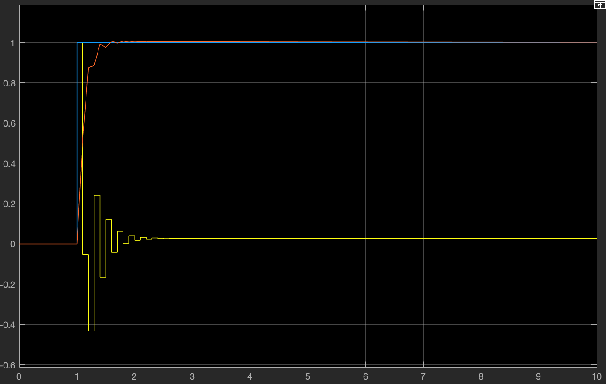
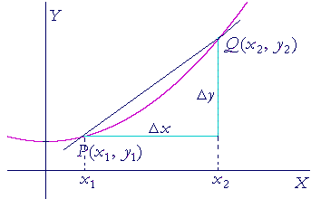

# D-Value of the PID Controller
<p style = "font-weight : 300; font-size : 24px;">
This page will go over the code implementation of the D-Term of the PID Controller.
</p>

---

## What is the Derivative Term

The <b>D-Value</b> is used for ensuring that the system does not approach the desired value too quickly. 
As per the definition of a derivative , the <b>D-Value</b> is the rate of change of error over time. If the system changes state too fast, it would have a very high negative slope (negative because as the system reaches the target the error decreases over time), which would dampen how fast it's going.
Since the D-Value decreases the power output, it is referred to as a dampener. In a PID or PD controller, the D-Value is often used to reduce oscillation (the system consistently overshooting and undershooting the target). This is because oscillation occurs due to the system not slowing down quick enough causing it to constantly overshoot and undershoot the target, but since the 
Derivative Term reduces the power output essentially dampening the speed, the oscillation would reduce and subside. 

> [!ATTENTION]
> Unlike the P-Value part of the PID Controller (P Controller) , the D-Value isn't standalone (can not be used by itself). It is often paired with a P-Value (PD Controller) , or with both the proportional and integral term (PID Controller).

---

## How do we calculate the derivative?

Similar to the integral, we cannot find the actual derivative, so we must approximate it. This can be done using the slope formula, since the derivative at a point is the slope at that point:

<figure align="center">
    
</figure>

In the case of the PID Controller, the derivative of error can be found using the equation : <b> (error - previousError) / (deltaTime)</b>.

---

## Tunable Constant

The tunable constant for the D-Value is <b>KD</b>.  The KD value allows control over the effect of the D-Value; a D-Value with a KD of 0.01 would have less impact on the system than a D-Value with a KD of 0.05.

---

## How does the KD Constant work?

To fully understand the KD constant , take a robot that is oscillating around 45 degrees for example:
- `Current position` : The current position in this example would be 44 - 46 degrees
- `Target position` : The target position in this example would be 45 degrees
- `error` : The error in this example would be Target position - Current position which is -1 to 1 degree

For example purposes , let's assume that we are using a PD Controller (PID Controller with the use of only the P and I terms). In this example, the robot is oscillating around 45 degrees (constantly undershooting and overshooting the target). In this case, the D-Value will come to use to make sure the robot doesn't change states that quickly such that it stops oscillating and smoothly reach the target position instead.
It is important to tune the KD value very well, a value that is too high could cause jittering while one that is too low wouldn't reduce the oscillation much.

---

<ul class="list-style-none" style = "text-align:center;">
  <li style = "display : inline;">
     
     <p class="mt-2 text-sm text-center text-gray-600" style = "float : right">In this example, a P controller is being used to move the robot forward a certain distance. A D-Value would be useful to reduce the oscillation at the end such that the robot reaches the target position in a much smoother manner.</p>
  </li>
  <li style = "display : inline;" >
     
     <p class="mt-2 text-sm text-center text-gray-600" style = "float : right">The same movement is implemented with a D-Value included this time. Notice how the oscillation is gone making the robot reach the target position in a much smoother and accurate manner.</p>
  </li>
</ul>

---

## What is the result of using D-Value?

---

<figure align="center">
    
    <figcaption class="mt-2 text-sm text-center text-gray-600" style = "padding-top : 10px;">System response with a well tuned KP & KI & KD Value.</figcaption>
</figure>

As seen above, with the use of the D-Value, the `oscillation` of the system has been completely <b>reduced</b> where <b>x is between 1.2 and 3</b>. 

With the use of the I-Value and D-Value , the system reaches the target position in a smooth and accurate manner with
<b>significantly less</b> `steady-state error` and `oscillations` compared to a P-Controller alone.

---

## Code Implementation

<figure align="center">
    
    <figcaption class="mt-2 text-sm text-center text-gray-600">Explanation of a Derivative</figcaption>
</figure>

In our implementation (x2 , y2) would be `(System.currentTimeMillis() , error)` and (x1 , y1) would be `(previousTime , previousError)`. The formula for the derivative is `(y2 - y1) / (x2 - x1)`. Substituting in our variables gets us the expression : `(error - previousError) / (System.currentTimeMillis() - previousTime)`. DeltaTime is already set equal to (System.currentTimeMillis() - previousTime) so we can replace the bottom with this.


```java 
   d = (error - previousError) / deltaTime;
   double D = KD * d;
```

---

<p style = "font-weight : 300; font-size : 24px;">
Here's what the getOutput() method should look like this far:
</p>

```java 
    public double getOutput(double currPos , double targetPos){
        this.error = targetPos - currPos;
        this.previousError = error;
        double P = KP * error; // Proportional term : KP constant * the error of the system
        this.deltaTime = System.currentTimeMillis() - previousTime;
        this.previousTime = System.currentTimeMillis();
        this.i += currPos > targetPos * 0.8 ? deltaTime * error : 0;
        double I = KI * i;
        this.d = (error - previousError) / deltaTime
        double D = KD * d
    }
``` 
