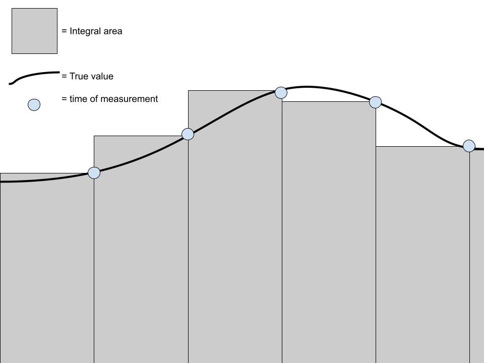
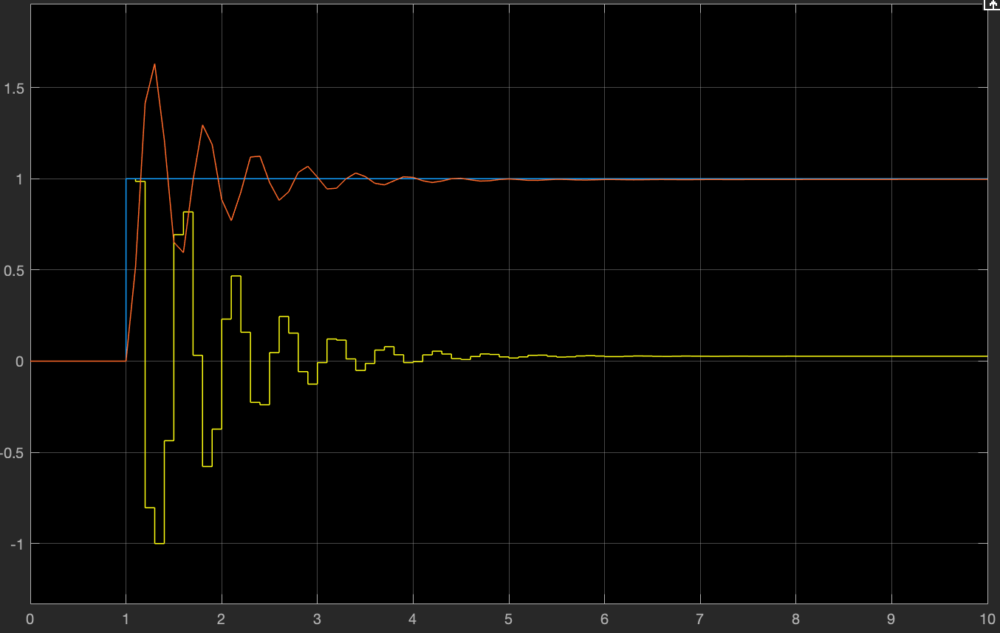

# I-Value of the PID Controller

<p style = "font-weight : 300; font-size : 24px;">
This page will go over the code implementation of the I-Term of the PID Controller.
</p>

---

## What is the Integral Term?

The `I-Value` is used for <b>increasing</b> the effects of a small error which essentially <b>reduces</b> the steady-state error of a system. For example, if a fly wheel was stuck at 119 rpm and they wanted to be at 120 rpm. Using P alone, the flywheel would never reach the desired value. However,  if you used I-Value, the effects of the small amount of error would cause a <b>large</b> change over time.

It can be thought of as an extra push to the system to close the tiny gap between where it is and where it wants to be.
> [!ATTENTION]
>- The I-Value of the PID Controller is not always used. In most cases, a well-tuned PD Controller (Proportional-Derivative) controller should suffice.
>- Unlike the P-Value part of the PID Controller (P Controller) , the I-Value isn't standalone (can not be used by itself). It is often paired with a P-Value (PI Controller) , or with both the proportional and derivative term (PID Controller).

## How would we integrate the error?
`Integration` is the process of
bringing together <b>smaller</b> parts to create a </b>whole. In the case of a PID Controller, it is the sum of <b>error over time</b>.

The `I-Value`, being an integral, is the total area under the curve of the graph of <b>error vs time</b> (area under the curve is the definition of an integral). The ideal way to represent the I-Value is <b>I(x) = KI*integral(x)</b>. Similar to the <b>P-Value</b>, this is also multiplied by a constant, <b>KI</b> , which is also found via tuning. While taking the integral of the error is basically what we do, we can't say that it is the exact integral of error, as there is no equation that exists that perfectly models the error vs time, since this is the real world. The next best thing is to approximate the integral using a reimann sum.


A riemann sum is used to integrate the error in the PID Controller in which the system:

```
    - Measures the change in position (error - previousError) since the last time data was recorded
    - Calculates the time since last time we recorded position (deltaTime)
    - Multiplies the change in position by the deltaTime
    - Adds that product to a running total sum of the integral
    - Repeats until reached target position
```

---

<figure align="center">
    
    <figcaption class="mt-2 text-sm text-center text-gray-600" style = "padding-top : 10px;">Integration using reimann sums.</figcaption>
</figure>

As seen from the image above, Reimann sums can be used to approximate the integral sum of the error over time in a system by essentially solving
the area since last run as a rectangle in which the delta time represents the width of the rectangle while the error represents the height. It then adds this 
area to a running total sum which would give us an approximation of the integral. The example above shows the graph of 5 loop runs in which the integral was calculated.

---

## Tunable Constant

The tunable constant for the I-Value is KI. The I-Value of the PID Controller essentially just adds the error over time ( adding all the previous values of the error function). You then multiply this total by the KI Value which allows you to have control over the effects of the I-Value. For example, a KI value of 0.01 will make the I-Value have less effect than an I-Value of 0.05.


## How does the KI constant work?

To fully understand the KI constant , take a robot that is facing 44 degrees with a 45 degrees target position as an example:
- `Current position` : The current position in this example would be 44 degrees
- `Target position` : The target position in this example would be 45 degrees
- `error` : The error in this example would be Target position - Current position which is 1 degree

For example purposes , let's assume that we are using a PI Controller (PID Controller with the use of only the P and I terms). The power output of the P-Value when the robot is so close to the target would be very low. This is because, the P-Value is directly proportional to the error of the system meaning , as error gets lower so does the P-Value. For this reason, a P Controller alone will never get the system to the desired position which results in steady-state error. In a case where the robot gets very close to the target position with a tiny bit of error, the I-Value becomes useful. Think of it as a final push for the robot to reach its desired position. It essentially closes the tiny gap between the current position and target position which gets rid of steady state error. A KI value that is too high would cause the effects of integration to be higher which could cause the robot to overshoot while a KI that is too low won't completely get the robot to its desired position. For this reason, it is very important to tune the Ki value such that it reaches the desired position without a significantly high undershooting or overshooting.


---


<figure align="center">
    
    <figcaption class="mt-2 text-sm text-center text-gray-600" style = "padding-top : 10px;">System response with a well tuned KP & KI Value.</figcaption>
</figure>

This is the result of adding a <b>I-Value</b> to the example shown previously on the <b>P-Value</b> page. The I-Value got rid of the `steady-state` error completely as seen above where <b>x >= 5</b>. However, there are still `oscillations` where <b>x is between 1.2 and 3</b> which we will solve using the D-Term.


## Code Implementation

The following code shows the implementation of the I-Value of the PID Controller. We only want the Integral term to take effect when the robot is very close to the target. For this reason we will only start integrating the error when the robot is 80% of the way there. Put the following code in the getOutput() method:

```java 
   // Check if you are greater than 80% of the way there
   // If you are, then start integrating. If you're not , then just add 0.
   i += currPos > targetPos * 0.8 ? deltaTime * error : 0;
   // The I-Value is KI * the integral
   double I = KI * i;
```

[//]: # ()
[//]: # (<!-- tabs:start -->)

[//]: # ()
[//]: # (#### **getOutput&#40;double currPos, double targetPos&#41;**)

[//]: # ()
[//]: # (```java )

[//]: # (   // Check if you are greater than 80% of the way there)

[//]: # (   // If you are, then start integrating. If you're not , then just add 0.)

[//]: # (   i += currPos > targetPos * 0.8 ? deltaTime * error : 0;)

[//]: # (   // The I-Value is KI * the integral)

[//]: # (   double I = KI * i;)

[//]: # (```)

[//]: # ()
[//]: # (#### **getOutput&#40;double error&#41;**)

[//]: # ()
[//]: # (```java )

[//]: # (   // Check if you are greater than 80% of the way there)

[//]: # (   // If you are, then start integrating. If you're not , then just add 0.)

[//]: # (   i += currPos > targetPos * 0.8 ? deltaTime * error : 0;)

[//]: # (   // The I-Value is KI * the integral)

[//]: # (   double I = KI * i;)

[//]: # (```)

[//]: # ()
[//]: # (<!-- tabs:end -->)


---

<p style = "font-weight : 300; font-size : 24px;">
This is what the getOutput() method shoulds look like thus far:
</p>

```java 
    public double getOutput(double currPos , double targetPos){
        this.error = targetPos - currPos;
        this.previousError = error;
        double P = KP * error; // Proportional term : KP constant * the error of the system
        this.deltaTime = System.currentTimeMillis() - previousTime;
        this.previousTime = System.currentTimeMillis();
        this.i += currPos > targetPos * 0.8 ? deltaTime * error : 0;
        double I = KI * i;
    }
```
