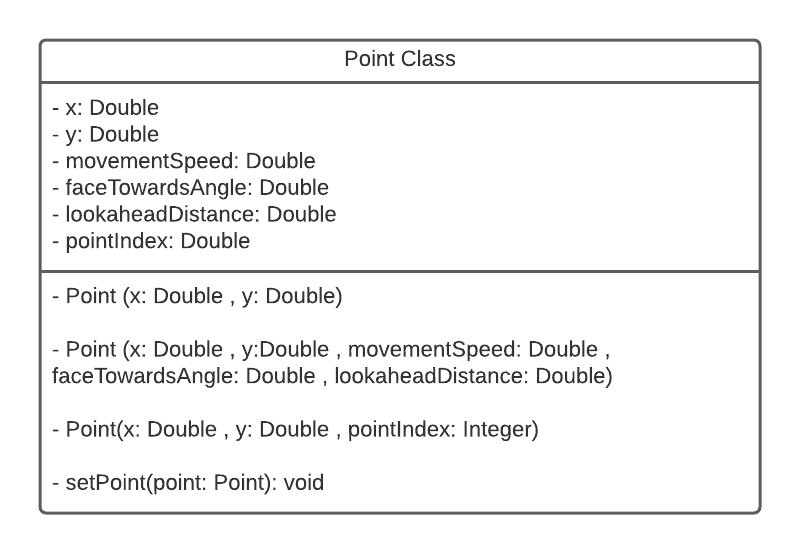

# Point

<p style = "font-weight : 300; font-size : 24px;">
This section will go over the implementation of our own custom Point class.
</p>

---

?>
Create the `Point.java` file under the `TeamCode` folder in your project directory.
> ```text
.
└── TeamCode
    ├── Motor.java
    ├── MecanumDriveTrain.java
    ├── TestOpModes
        ├── EncoderReadingTest.java
    ├── Point.java
> ```

---

<figure align="center">
    
    <figcaption class="mt-2 text-sm text-center text-gray-600" style = "padding-top : 10px;">Point class diagram</figcaption>
</figure>

---

## Code implementation

There are four use cases for this class:
- `2d Point` : (x position , y position) in a 2d space
- `Lookahead Point` : (x position , y position) , movementSpeed , lookaheadDistance , faceTowardsAngle
- `Path point` : (x position , y position) , movementSpeed , lookaheadDistance , faceTowardsAngle
- `Point index` : (x position , y position) , pointIndex

### Global variables
- `x` : x value of the Point
- `y` : y value of the Point
- `movementSpeed` : movement speed of the Point
- `faceTowardsAngle` : face  angle of the Point
- `lookaheadDistance` : lookahead distance of the Point
- `pointIndex` : index of the path the point is at 

```java 
    public double x;
    public double y;
    public double movementSpeed;
    public double faceTowardsAngle;
    public double lookaheadDistance;
    public int pointIndex;
```

## Constructors
Even though there are four different use cases, we will only need to make three constructors since two of the use cases use the same values:

```java 
    public Point(double x , double y){
        this.x = x;
        this.y = y;
    }
    
    public Point(double x , double y , double movementSpeed , double faceTowardsAngle , double lookaheadDistance){
        this.x = x;
        this.y = y;
        this.movementSpeed = movementSpeed;
        this.faceTowardsAngle = faceTowardsAngle;
        this.lookaheadDistance = lookaheadDistance;
    }
    
    public Point(double x , double y , int pointIndex){
        this.x = x;
        this.y = y;
        this.pointIndex = pointIndex;
    } 
    
```


---

Here's what the Point class should look like:
```java 
    public double x;
    public double y;
    public double movementSpeed;
    public double faceTowardsAngle;
    public double lookaheadDistance;
    public int pointIndex;
    
    public Point(double x , double y){
        this.x = x;
        this.y = y;
    }
    
    public Point(double x , double y , double movementSpeed , double faceTowardsAngle , double lookaheadDistance){
        this.x = x;
        this.y = y;
        this.movementSpeed = movementSpeed;
        this.faceTowardsAngle = faceTowardsAngle;
        this.lookaheadDistance = lookaheadDistance;
    }
    
    public Point(double x , double y , int pointIndex){
        this.x = x;
        this.y = y;
        this.pointIndex = pointIndex;
    } 
    
    public void setPoint(Point point){
        this.x = point.x;
        this.y = point.y;
    }
    
```


We now have our very own custom Point class that we can use when dealing with the different types of points in following sections.

