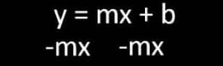
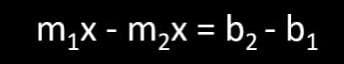
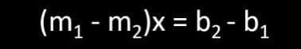
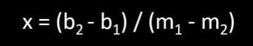

# Clip To Line

<p style = "font-weight : 300; font-size : 24px;">
This page will go over the clipToLine() method.
</p>

---

This method will be used to get the index of current line segment we currently on in the path. This method will return the point of intersection between a perpendicular line going through the robot's center and the line segment.


## Line equations

We will need to come up with two equations:
- `Segment equation` : y = mx + b
- `Perpendicular equation` : y = (-1/m)x + b

## Perpendicular slope

The slope of a line perpendicular to a line segment could be found by negating the inverse of the line segment's slope.
This can be represented by `- 1/m`.

## Y intercept

Since we know the values of m , x , and y, the only unknown variable is b. We can solve for b by isolating it:

---

<figure align="center">
    
    <figcaption class="mt-2 text-sm text-center text-gray-600">The equation of a line.</figcaption>
</figure>

---

<figure align="center">
    
    <figcaption class="mt-2 text-sm text-center text-gray-600">Subtract mx from both sides</figcaption>
</figure>

---

<figure align="center">
    
    <figcaption class="mt-2 text-sm text-center text-gray-600">Equation to find the y intercept , b.</figcaption>
</figure>

---

The equation to find `b` is : `b = y - mx` where:
- `y` : Y value of point (x , y) on the line
- `m` : Slope of the line
- `x` : X value of point (x , y) on the line

## Solutions of a line-line intersection

You can find the solutions , x value , at which two line intersect with each other by setting the equations of the respective lines equal to each other.

---

<figure align="center">
    
    <figcaption class="mt-2 text-sm text-center text-gray-600">Set the two line equations equal to each other</figcaption>
</figure>

---

<figure align="center">
    
    <figcaption class="mt-2 text-sm text-center text-gray-600">Get the terms with x one side and the constants on the other</figcaption>
</figure>

---

<figure align="center">
    
    <figcaption class="mt-2 text-sm text-center text-gray-600">Factor out (m2 - m1) so we can isolate x</figcaption>
</figure>

---

<figure align="center">
    
    <figcaption class="mt-2 text-sm text-center text-gray-600">Divide both sides by (m2 - m1) to get the final equation</figcaption>
</figure>

---

Now, we have an equation that will get us the x value of the point of intersection between the two lines: `x = (b2 - b1) / (m2 - m1)` where :
- `b1` : Y-intercept of the first line equation
- `b2` : Y-intercept of the second line equation
- `m1` : Slope of the first line equation
- `m2` : Slope of the second line equation

## Code Implementation

```java 
    public static Point clipToLine(Point linePoint1 , Point linePoint2 , Point robotLocation){
        // Make sure the start point and end point of the line segment aren't the same
        // If they have same y values or x value s, they can have an undefined or 0 slope
        if(linePoint1.x == linePoint2.x){
            linePoint1.x = linePoint2.x + 0.0001;
        }

        if(linePoint1.y == linePoint2.y){
            linePoint1.y = linePoint2.y + 0.0001;
        }

        // Calculate the slope of the line segment using rise / run
        double m1 = (linePoint2.y - linePoint1.y) / (linePoint2.x - linePoint1.x);
        // Calculate the slope of a perpendicular line by negating the inverse of slope1
        double m2 = -(1 / m1);

        /* Find the y-intercepts, since the end point is a point on the line of the line segment, 
        we can use those value as the (x , y) in the equation for b1. Since the robotLocation is on the
        perpendicular line, we can use its (x , y) in the equation for b2.*/
        double b1 = linePoint2.y - m1 * linePoint2.x;
        double b2 = robotLocation.y - m2 * robotLocation.x;

        // Find clipped x using this equation
        double clippedx = (b2 - b1) / (m1 - m2);
        // Find clipped y by pluggin in clipped x as the x value
        double clippedy = (m1 * (clippedx) + b1);

        // Return the point of intersection
        return new Point(clippedx , clippedy);
    }
``` 

---

<p style = "font-weight : 300; font-size : 24px;">
Now , we have a method that can find the intersection between a perpendicular line and a given line segment. This method will be used in the following page to calculate which segment of the path the robot is currently on.
</p>
