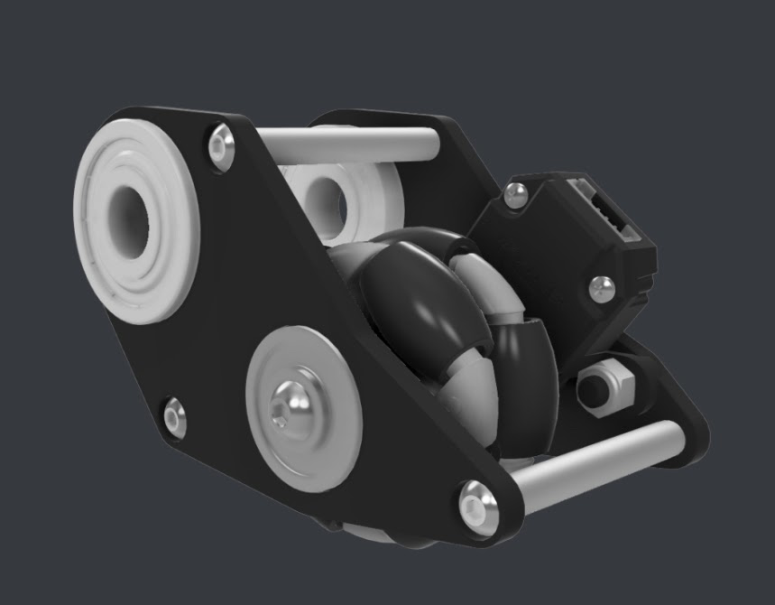

# Dead Wheels

> [!ATTENTION]
> The dead wheels need to be spring-loaded so that they are always in contact with the ground. This ensures that the encoder readings are always accurate and that the wheels never raise off the ground as that would throw off the readings and position calculations.

> [!ATTENTION]
> This is for both Tank and Mecanum Drivetrains.
>> Although dead wheels can be used on Tank drivetrains, it is usually not necessary. Since the drivetrain wheels on a Tank Drivetrain don't slip significantly, the two vertical wheels of a tank drivetrain with encoders can be used for localization instead.

>[!TIP] [Dead Wheels Opensource Design](https://openodometry.weebly.com/)  
---

<b>Dead Wheels</b> are widely used synchronously with Odometry in a holonomic drive train as they experience very minimal drift and produce very efficient and acccurate readings. Motor encoders, on the other hand , experience heavy slippage in instances of high acceleration and speeds on Mecanum drivetrains. Dead wheels are essentially just unpowered omniswheels that are not connected to any motor. Rotary encoders on the wheels allow us to retrieve the current position of the motor in ticks and with the use of constants such as the `WHEEL DIAMETER` and `TICKS PER REVOLUTION` , you can convert these ticks into inches.

- `WHEEL_DIAMETER` : Diameter of the omni wheel
- `TICKS PER REVOLUTION` : Ticks per revolution of the dead wheel encoder

---

<figure align="center">
    
    <figcaption class="mt-2 text-sm text-center text-gray-600" style = "padding-top : 10px;">An example of an assembled Dead Wheel</figcaption>
</figure>

---
