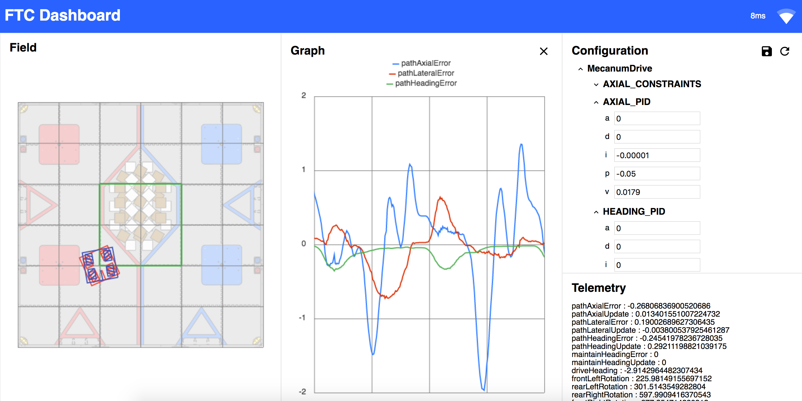

# Drive Controller tuning

<p style = "font-weight : 300; font-size : 24px;">
This section will go over the tuning process of the Drive PID Controller.
</p>

---

## OpMode

First, we need to set up an opMode for tuning the Drive PID Controller; it should be annotated with `@TeleOp` and extend the OpMode class.

### Variables
- `mecanumDriveTrain` : Instance of our mecanumDriveTrain class
- `KP` : KP value for the controller
- `KI` : KI value for the controller
- `KD` : KD value for the controller
- `dashboard` : Instance of the FTCDashboard

All the PID Constants have to be static. This allows us to change these values directly from FTC Dashboard which gets rid of having to upload the code everytime we change the values during the tuning process.

---

<figure align="center">
    
    <figcaption class="mt-2 text-sm text-center text-gray-600">We can edit the KP , KI , and KD value in the configuration window directly from the FTCDashboard by making them static.</figcaption>
</figure>

---

### Init method

In the init method, we will initialize the mecanumDriveTrain, the driveController , and dashboard.

### Loop method

In the loop method, we will have the robot drive forward 20 inches while outputting the error in the FTCDashboard telemetry


```java 
@TeleOp @Config
public class DriveTuner extends OpMode{
    private MecanumDriveTrain mecanumDriveTrain;
    private FTCDashboard dashboard;
    
    // Declare the static PID Contstants.
    public static double KP = 0;
    public static double KI = 0;
    public static double KD = 0;
    
    @Override
    public void init() {
        dashboard = FTCDashboard.getInstance();
        // This allows us to output telemetry to the FTC Dashboard
        telemetry = new MultipleTelemetry(telemetry , dashboard.getTelemetry());
        
        /* We can pass in the multipleTelemtry instance now and 
        the tuner method will use it to output telemetry */
        mecanumDriveTrain = new MecanumDriveTrain(hardwareMap , telemetry);
        mecanumDriveTrain.driveController.setConstants(KP , KI , KD);
    }
    
    @Override
    public void loop() {
        // Since we only want to move forward, 
        set the y target position to 20 and everything else to 0. 
        This will move the robot in the forward direction 20 inches.*/
        goToPosition(0 , 20 , 0 , 0.5);
    }
    
}    


```


## Tuning Process

### Before we begin

1. Follow the steps shown on [the FTCDashboard Get Started page](https://acmerobotics.github.io/ftc-dashboard/gettingstarted) to set up the FTCDashboard and connect to WiFi Network broadcast using the Robot Controller phone.
2. Make sure [the Dashboard](192.168.49.1:8080/dash) opens up properly when you navigate to it.
3. Familiarize yourself with [the FTCDashboard features](https://acmerobotics.github.io/ftc-dashboard/features)
4. Make sure you see DriveTuner under the configuration window on the top left of the site.
- Check to see that the `KP` , `KI` , and `KD` values are visible

--- 

In the PID tuning process, `KP` is tuned first , then `KD` , then `KI`.

### Let's Begin

1. We can now begin our tuning process. Stretch out a clear straight path of 20 + inches of field tiles.
2. A good rule of thumb is to set the KP to a very low random value when tuning a PID Controller.
- Do this by editing the KP value under the DriveTuner in the Configuration window
3. Now, initialize the `DriveTuner` class and ensure that no errors are thrown
4. Now, run the `DriveTuner` class and observe the robot and the graph as it moves
5. Analyze the result:

<b>KP tuning</b>
- If the robot undershot the target significantly, increase KP
- If the robot overshot the target , decrease KP

If the robot oscillated around the target (overshot , then undershot, and then arrived at its target) , you are done tuning KP and can now move onto KD by setting KD to a very low value such as 0.005.

<b>KD tuning</b>
- If the robot oscillation is still noticeable, increase KD
- If the robot started jittering (oscillated rapidly around the target), decrease KD

If the robot reached the target smoothly without much overshooting, undershooting, or oscillation , you are done with KD tuning:
- If the robot reaches its target position consistently across many runs with just KP and KD , then a KI constant isn't needed ( leave it at 0 ).
- If the robot sometimes reaches it target, but other times only gets very close to it (19 inches instead of 20) , then KI tuning is needed

<b>KI tuning</b>
- If the robot error didn't decrease much from the previous run, then increase KI
- If the robot error decreased significantly such that it gets very close to its target position, then increase KI a very tiny bit

If the robot reaches the target with very low error in a smooth and accurate fashion, then the Drive PIDController is done being tuned.

Note the tuned `KP`, `KI`, and `KD` values and insert them into the `TunableConstants` Interface we created earlier.
