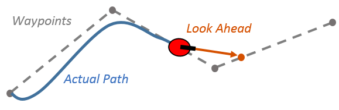
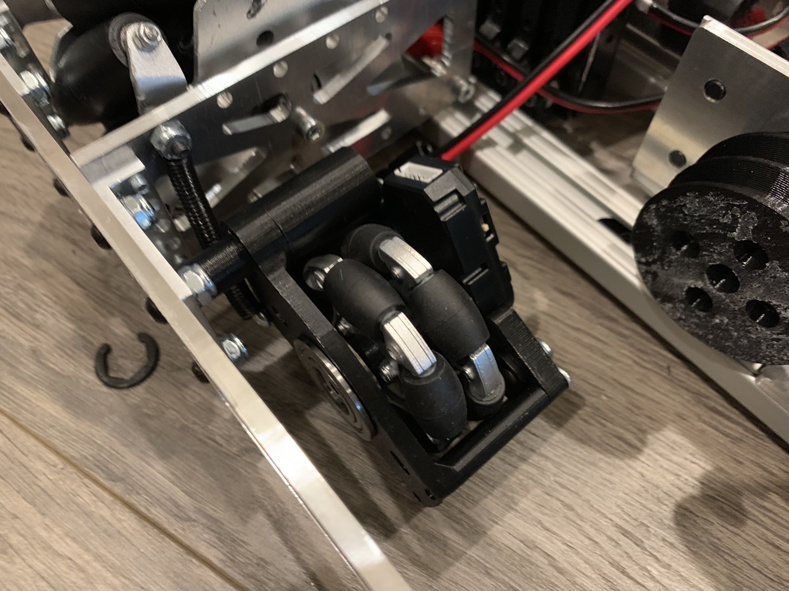

# Frequently Asked Questions

This page answers questions that you may have about things related to path following in FTC

---

> [!ATTENTION]
> This page is for both Tank and Mecanum Drivetrains

## What is Pure Pursuit?

The `pure pursuit controller` is a path following algorithm mainly used by differential drive (tank drive). The core mechanic of the Pure Pursuit controller is calculating the curvature that will move the robot from its current position (x, y) to its target position (x, y) smoothly and accurately. The target point is calculated using some distance away from the robot's current position, a constant called the `lookahead distance`. Pure Pursuit is mainly used to allow robots to turn while moving which essentially creates a smooth curve motion along turns making it a popular option for non-holonomic drivetrains (can only move back and forth / turn). Compared to other path-following algorithms such as Ramsete (another path following algorithm for tank drive) and motion planning libraries like RoadRunner (mainly used for holonomic drive trains), Pure pursuit does not have any control on acceleration.

<figure align="center">
    
    <figcaption class="mt-2 text-sm text-center text-gray-600">An example of the Pure Pursuit controller smoothly following a path using a lookahead distance.</figcaption>
</figure>

## How does our path following algorithm compare to Pure Pursuit?

The core mechanic of the Pure Pursuit controller and our path following algorithm is very similar :

     Get the current position of the robot (x , y) 
                        |
     Get the target point a certain lookahead distance away from our current position
                        |
     Get the individual motor powers given target point
                        |
     Set the power to the motors

The major differences between the two algorithms occur in how the powers are calculated and dealing with the robot heading. The Pure Pursuit controller is designed such that the robot moves forward while turning towards the angle deviation between the current position and a target point. Since this inertly assumes that the robot can only move back/forth and turn, it makes it very difficult to cut very tight corners. For this reason, path following implemented with the Pure Pursuit Controller have to plan the paths such that no tight corners exist which is convenient for tank drivetrains, but can be inefficient and annoying for holonomic drivetrains given their omnidirectional capabilities. For this reason, our path following algorithm is designed such that the robot moves towards a target point in any direction while keeping a target heading. Unlike the non-omnidrectional tank drive, the omnidirectional mecanum robot can cut tight corners very efficiently with the use of field centric movements. 

Another major difference occurs in how we get the actual motor powers. Instead of using the curvature between the current position and the target position, our simplification of outputting the motor powers is having three different PID Controllers:

    -PID controller on heading 
    -PID controller on y deviation (Target y - Current Position y)
    -PID controller on x deviation (Target x - Current Position x)

The PID outputs of these three controllers are then inputted into an algorithm that converts the outputs into field-centric powers allowing the robot to move towards a target point regardless of robot heading. To sum up, our path following algorithm is much more efficient compared to pure pursuit in the case of a Holonomic drive train implementation as it allows the robot to move in a similar smooth pattern with the additional benefit of being able to cut very tight corners and move towards a point regardless of heading.

## What to consider when making Dead Wheels?

There are many factors to consider when choosing the different places to position the `dead wheels` and physically making them. The optimal position to put the `horizontal dead wheel` in a three-wheel odometry configuration is the exact center of rotation of the robot. The `vertical dead wheels` should be placed parallel to each other; they are often placed facing towards the front of the robot, 8+ inches away from each other. Although these exact positions aren't 100% necessary, they may result in more accurate calculations and less math to worry about. If mechanical constraints make the positioning of the horizontal encoder in the exact center impossible, it is fine as the math will account for this. When mounting the dead wheels onto the robot, it is important to spring load them. This assures that the wheels are always in contact with the ground ensuring the accuracy of the odometry position tracking system.

<figure align="center">
    
    <figcaption class="mt-2 text-sm text-center text-gray-600">An example of a properly spring-loaded dead wheel</figcaption>
</figure>

## Where to purchase encoders and Omni Wheels?
Reliable `encoders` can be expected to cost $30+ dollars and `Omni Wheels` , 5+$. Here are some links to purchase them :

FTC Encoders :
- [E4T Encoder](https://www.usdigital.com/products/encoders/incremental/kit/e4t/)
- [E8T Encoder](https://www.usdigital.com/products/encoders/incremental/kit/e8t/)
- [REV Through Bore Encoder](https://www.revrobotics.com/rev-11-1271/)

FTC Omni Wheels:
- [REV 60mm Dead Wheel](https://www.revrobotics.com/rev-41-1160/)
- [Go Builda 72mm Dead Wheel](https://www.gobilda.com/3604-series-omni-wheel-14mm-bore-72mm-diameter/?gclid=Cj0KCQiA5aWOBhDMARIsAIXLlkfBT80splhvvBGcN10rqBg9oRXL-bzq0Xk7E6e-6dCYkC_6tVMBG0YaAg15EALw_wcB)
