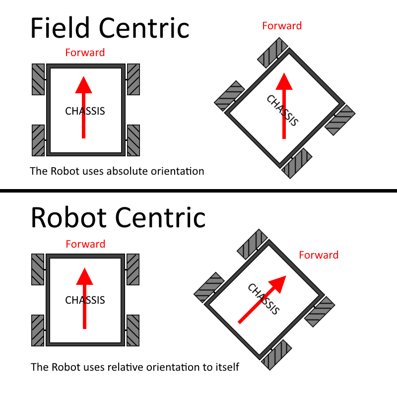

# Field Centric

> [!ATTENTION]
> This page is only for Mecanum Drivetrains.

___

<b>Field-centric movement</b> is a key component to this path following algorithm. Field-centric is very different compared to the
conventional Robot-centric movement for one key reason. To understand the core difference, let's take a robot facing south as an example.
In a Robot-centric movement algorithm, telling the robot to move forward would cause the robot to move further south. In a Field-centric movement
algorithm , however, telling the robot to move forward would cause it to strafe towards the north. In other words, <b>Field-centric movement</b>
occurs in relation to the field while Robot-centric occurs in relation to the robot heading.

<figure align="center">
    
    <figcaption class="mt-2 text-sm text-center text-gray-600">A visual showing the core difference between Robot and Field centric movements.</figcaption>
</figure>
