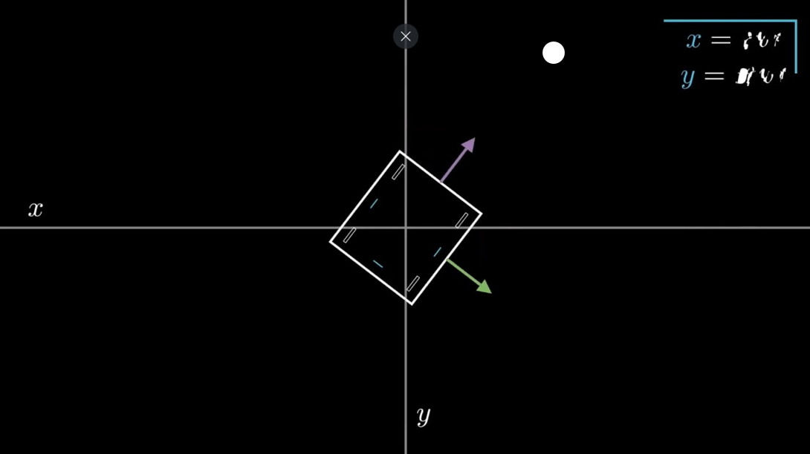
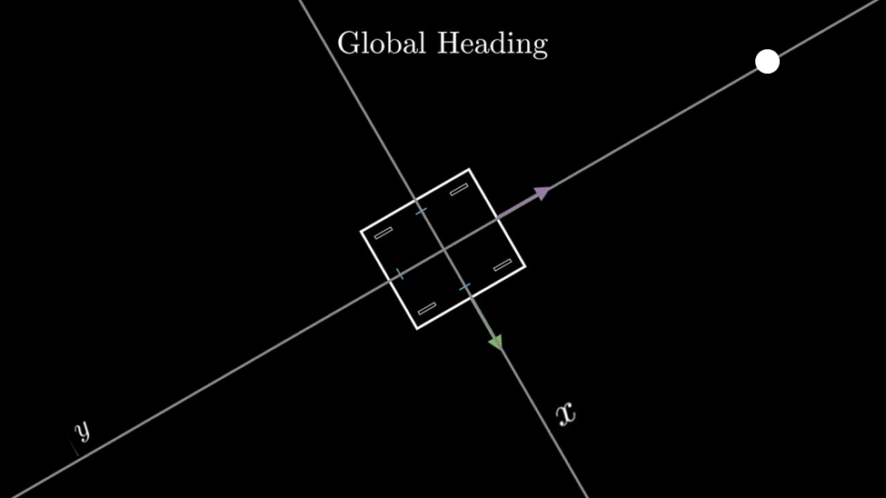
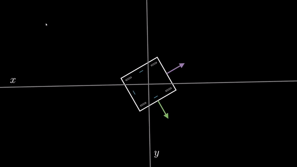
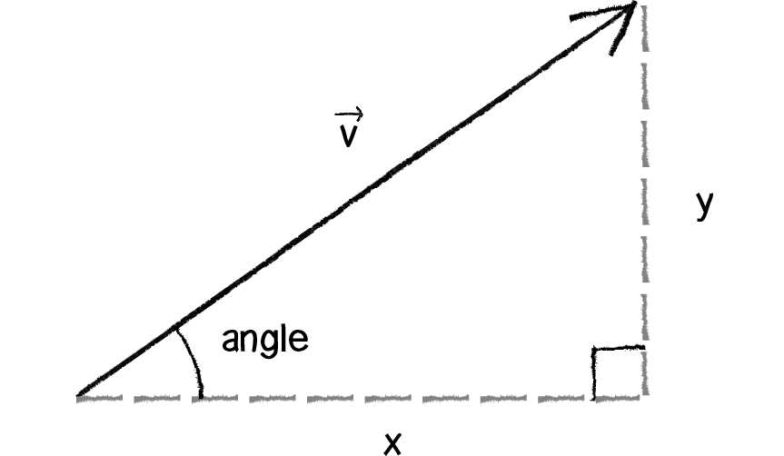
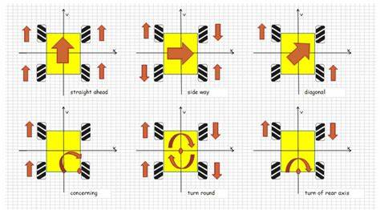

# Field Centric

[What is field centric movement?](https://rohitdasari0424.github.io/lookaheadPointTerm.html)

<p style = "font-weight : 300; font-size : 24px;">
This page will go over the implementation of the field centric method. This method should be placed in the Mecanum Drivetrain Class we made earlier.
</p>

---


## Why use field centric?

We will use field centric to take advantage of a mecanum drivetrain's omnidirectional capabilities to the fullest. This would allow us to cut very tight corners and move while turning.

---

<figure align="center">
    
    <figcaption class="mt-2 text-sm text-center text-gray-600">Team 18523, Vertigo , using field centric movement to turn while moving at the beginning to face the warehouse.</figcaption>
</figure>

---

As seen by the example, using the mecanum field centric capabilities cuts down on time taken to turn while moving very smoothly.
The field centric method essentially just allows the robot to move to a point regardless of the angle it is facing.

## Movement variables

There are three movement variables:

- `movement_x` : The PID output of the x error (targetPosition.x - currentPosition.x)
- `movement_y` : The PID output of the y error (targetPosition.y - currentPosition.y)
- `movement_turn` : The PID output of the angle error (targetHeading -  robotHeading)


These three variables will be passed in as arguments. The field centric method will then take these values and change them such that they're field centric (allowing the robot to move to a point given any robot heading).

## Getting the field centric movement variables

The movement_turn stays the same , but we need to do some basic trig to get the new movement_x and movement_y. What is essentially happening is that the robot takes the current heading into consideration and determines which direction it needs to move in.

To understand this concept, let's take a robot that is facing -45 degrees with a target position (25 , 25) for example:

---

<figure align="center">
    
    <figcaption class="mt-2 text-sm text-center text-gray-600">Robot facing -45 degrees with a target position (25 , 25)</figcaption>
</figure>

---

- `x error` : (targetPosition.x - currentPosition.x) which is 25
- `y error` : (targetPosition.y - currentPosition.x) which is 25
- `turn error` : turn error would be zero since we are facing the angle
- `movement_x` : movement x would be 1.0
- `movement_y` : movement y would be 1.0
- `movement_turn` : movement turn would be 0


The problem with this is that the movement_x (which is supposed to be strafe power) is 1.0, so we would be strafing even though we should only be moving forward in this situation. This is because robot centric movement_x and movement_y don't take the heading of the robot into account. So, we have to implement logic that changes the movement_x and movement_y based on the robot's heading.
The desired movement variables for this situation should be:
- `movement_x` : 0 (since we don't need to strafe to get to (25 ,25) since we are facing towards it)
- `movement_y` : 1.0 (since the target point is in front of the robot so moving forward would get us to it)
- `movement_turn` : 0 (since we are already facing the target point)

The solution to calculating the new movement variables is aligning the field to the forward direction of the robot. Then, we can calculate the new movement_x and movement_y by using Math.cos() and Math.sin() on the angle to the point.

---

<figure align="center">
    
    <figcaption class="mt-2 text-sm text-center text-gray-600">Field rotated such that it faces the forward direction of the robot</figcaption>
</figure>

---

## Code Implementation

### Rotate the field to robot heading

In this section, we will calculate the new angle to the target point by rotating the field to the robot's heading.

---

<figure align="center">
    
    <figcaption class="mt-2 text-sm text-center text-gray-600">Rotating the field so that it faces the forward direction of the robot</figcaption>
</figure>

---

```java 
    // We can rotate the field by getting the angle to the point and offsetting it by the robot heading
    double newAngle = Math.atan2(movement_y , movement_x) - odometry.getHeading();
```

### Calculating the new movement components

Now that we have the field centric angle to the point, we can find the new field centric movement variables.
To understand the different equations, let's take a look at a vector with two components; x component , y component:
- `x component` : Represented by the x
- `y component` : Represented by the y
- `movement vector` : represented by the V

<figure align="center">
    
    <figcaption class="mt-2 text-sm text-center text-gray-600">Two components of the movement vector example</figcaption>
</figure>

We can find the magnitude of the movement vector by calculating the hypotenuse of the two movement components : movement_x and movement_y. We can then use this magnitude to calculate the field centric movement components using:
- `movement_x` : Math.cos(newAngle) * magnitude
- `movement_y` : Math.sin(newAngle) * magnitude

```java 
    // Calulate magnitude of movement vector
    double magnitude = Math.hypot(movement_y , movement_x);
    
    // Calculate the individual components of the vector
    double fieldCentric_movement_x = Math.cos(newAngle) * magnitude;
    double fieldCentric_movement_y = Math.sin(newAngle) * magnitude;
```

### Turning movement variables into motor powers

To understand the 4 equations for calculating the individual motor powers for a mecanum drivetrain using movement_x , movement_y , and movement_turn, let's assume three situation:
- The robot is moving forward (using movement_y)
- The robot is strafing to the right (using movement_x)
- The robot is turning clockwise (using movement_turn)

Let's use this image for reference :

<figure align="center">
    
</figure>

---

<b>The robot is moving forward (using movement_y)</b>

When the robot is moving forward, we want all the motors to be moving forward, so it should be positive in all the equations.

---

<b>The robot is strafing to the right (using movement_x)</b>

When the robot is strafing to the right, we want the top left and bottom right to be moving forward while the top right and bottom left move backwards. So movement_x should be positive in the topLeft and bottomRight power equations and negative in the topRight and bottomLeft equations.

---

<b>The robot is turning clockwise (using movement_turn)</b>

When the robot is turning counterclockwise, we want the left set to move forward while the right set to move backwards. So movement_turn should be positive for the topLeft and bottomLeft and negative for topRight and bottomRight.

---

Final Equations:
- `topLeft` : movement_y + movement_x + movement_turn
- `bottomLeft` : movement_y - movement_x + movement_turn
- `topRight` : movement_y - movement_x - movement_turn
- `bottomRight` : movement_y + movement_x - movement_turn


### Final Code Implementation

```java 
    public void fieldCentric(double movement_x , double movement_y , double movement_turn){
        // We can rotate the field by getting the angle to the point and offsetting it by the robot heading
        double newAngle = Math.atan2(movement_y , movement_x) - odometry.getHeading();
        
        // Calulate magnitude of movement vector
        double magnitude = Math.hypot(movement_y , movement_x);
    
        // Calculate the individual components of the vector
        double fieldCentric_movement_x = Math.cos(newAngle) * magnitude;
        double fieldCentric_movement_y = Math.sin(newAngle) * magnitude;
        
        double topLeftPower = fieldCentric_movement_y + fieldCentric_movement_x + movement_turn;
        double bottomLeftPower = fieldCentric_movement_y - fieldCentric_movement_x + movement_turn;
        double topRightPower = fieldCentric_movement_y - fieldCentric_movement_x - movement_turn;
        double bottomRightPower = fieldCentric_movement_y + fieldCentric_movement_x - movement_turn;
        
        // Now we can just set the power to the motors
        tl.setPower(topLeftPower);
        bl.setPower(bottomLeftPower);
        tr.setPower(topRightPower);
        br.setPower(bottomRightPower);
    }
```

---

<p style = "font-weight : 300; font-size : 24px;">
We now have a fieldCentric() method that can get the robot to a target position given any robot heading.
</p>
