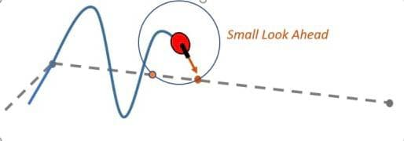
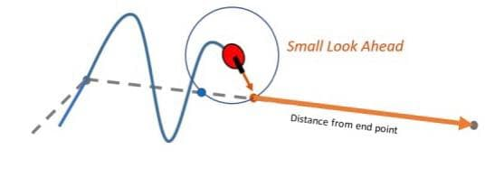
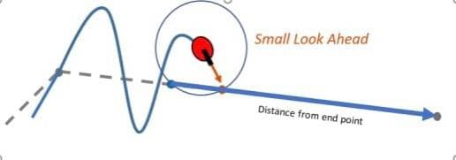

# Get Lookahead Point

<p style = "font-weight : 300; font-size : 24px;">
This page will go over the getLookaheadPoint() method.
</p>

---

As we know, the line-circle intersection method could return two intersections, so we need a way to choose which one to follow. The obvious solution to this problem would be checking which one of the intersections is closer to the last point in the path (the destination) and setting that point as the target.

<figure align="center">
    
    <figcaption class="mt-2 text-sm text-center text-gray-600">As demonstrated by the visual, the robot circle intersects the line segment of the path at two points.</figcaption>
</figure>


## Code Implementation

The code implementation of this method would iterate through the path and intersect the circle with each segment. This would return an array list of intersections for each line segment. Most of these array lists should be empty except the line segments that we are actually intersecting. We can then iterate through the array lists and find the intersection that is closest to the end of the path and set this as our lookahead point.

```java 
// Parameter path : Pass in the path array list that the robot is following
// Parameter robotLocation : Pass in the robot location (x position , y position)
public static Point getLookaheadPoint(ArrayList<Point> path , Point robotLocation){

}
```

### Iterate through the points of the path

The first step is to iterate through the points in the path. By doing this we can get the <b>start point (path.get(i))</b> and <b>end point (path.get(i + 1))</b> of each segment
and plus these in to our line-circle intersection method. This would then return any intersections the robot may have with this line and then check if any one of the intersections is closer than the previous line segments' intersections.
The loop will run till it has iterated through every point in the path , in other words every line segment in the path. At the end it will have stored how far the closest intersection is to the end of the path and set the x and y of the lookahead point equal to that of this intersection, in other words it will have found the intersection point closest to the end of the path.

```java 
    // Get the current index we are on the path
    Point currIndexInPath = clipToPath(path , robotLocation);
    /*Since the clipToPath returns a Point with the values : x (x position of intersection) , y (y position of intersection) , and pointIndex (the current index of the path we are on),
      we can use the pointIndex to get the end point of the line segment we are currently on in the path. This gives us control over the loookahead distance of the robot on each line segment since 
      we initialize all the path points ourselves. This point will inherit all the values of the point in the path such as lookaheadDistance , movementSpeed etc.
    */
    Point currPointInPath = path.get(currIndexInPath.pointIndex);
    // Start off by setting the lookahead point to something random so it isn't null
    Point lookahead = path.get(path.size() - 1);
    // Store the lastPoint as a Point so we can use it later on in the method
    Point lastPoint = path.get(path.size() - 1);
    
    // Set the closest distance to somethind absurdly high that no intersection is going to be above.
    double closestDistance = 100000000;
    // For loop to iterate through the points in the path
    for(int i = 0; i < path.size() - 1; i++){

    }
```

### Segment Line-Circle intersection

We will now intersect the current segment of the iteration with the robot's circle:

```java 
    // Get the current index we are on the path
    Point currIndexInPath = clipToPath(path , robotLocation);
    /*Since the clipToPath returns a Point with the values : x (x position of intersection) , y (y position of intersection) , and pointIndex (the current index of the path we are on),
      we can use the pointIndex to get the end point of the line segment we are currently on in the path. This gives us control over the loookahead distance of the robot on each line segment since 
      we initialize all the path points ourselves. This point will inherit all the values of the point in the path such as lookaheadDistance , movementSpeed etc.
    */
    Point currPointInPath = path.get(currIndexInPath.pointIndex);
    // Start off by setting the lookahead point to something random so it isn't null
    Point lookahead = path.get(path.size() - 1);
    // Store the lastPoint as a Point so we can use it later on in the method
    Point lastPoint = path.get(path.size() - 1);
    
    // For loop to iterate through the points in the path
    for(int i = 0; i < path.size() - 1; i++){
        // Get the starting point of the line segment
        Point startPoint = path.get(i);
        // The ending point would jsut be the next point in the path so i + 1
        Point endPoint = path.get(i + 1);
        
        // Intersect the robot with this line segment. 
        /* Pass in the lookahead distance of the current path point we are on.*/
        ArrayList<Point> intersections = lineCircleIntersection(startPoint , endPoint , 
                                                            robotLocation , currPointInPath.lookaheadDistance);
    }    
```

### Iterate through intersections

<figure align="center">
    
    <figcaption class="mt-2 text-sm text-center text-gray-600" style = "padding-bottom : 25px">A visual showing the distance between the first intersection of the list and the end point of the path.</figcaption>
</figure>

<figure align="center">
    
    <figcaption class="mt-2 text-sm text-center text-gray-600">A visual showing the distance between the second intersection of the list and the end point of the path.</figcaption>
</figure>


---

Now, we will iterate through the intersections between the current line segment we are on in the iteration process and the robot's circle:

```java 
    for(Point intersection : intersections){
        // Calculate how far the intersection point is from the end of the path using the distance formula
        double distanceToEnd = Math.sqrt(Math.pow(lastPoint.x - intersection.x , 2) +
        Math.pow(lastPoint.y - intersection.y , 2));
            
            /* Check if this iteration is currently the closest one recorded so far
                For example , if the previous line segment's intersection was 10 inches away and the
                current line segment's intersection is 5 inches away, then this intersection is closer than the
                other intersection. Then during the next iteration, the method would check if the intersection is lower than 5.
                This allows us to find the intersection that is closest to the end of the path.
            */
        if(distanceToEnd < closestDistance){
        // Update the closest distance an intersection point has been recorded to be from the end
        closestDistance = distanceToEnd;
        // Set the lookahead point to the x and y of the intersection
        lookahead.setPoint(intersection);
        }

    }
```

### Setting lookahead to last point

If the robot gets very close to the end of the path, the radius of the circle we are intersecting will eventually be greater than the distance between the robot and the end of the path. This will cause the circle to only intersect the line at one point - which is behind the robot, not the front. This would cause the robot to move backwards instead of  towards the end point. The solution to this problem is to check if the robot is very close to the the point in which the circle would pass the end point. If it is, then set the target point to the end point of the path, essentially telling the robto to just go to the path end since we are getting close to it.

```java    
    // Find the distance between the robot and the end of the path
    // If we are very close to the end of the path, then just set the lookahead to the last point in the path
    if(Math.sqrt(Math.pow(lastPoint.x - robotLocation.x , 2) + Math.pow(lastPoint.y - robotLocation.y , 2)) <= currPointInPath.lookaheadDistance + 5){
        lookahead.setPoint(lastPoint);
    }
```

---

<p style = "font-weight : 300; font-size : 24px;">
This is how the implemented getLookaheadPoint() should look like:
</p>

```java 
// Parameter path : Pass in the path array list that the robot is following
// Parameter robotLocation : Pass in the robot location (x position , y position)
public static Point getLookaheadPoint(ArrayList<Point> path , Point robotLocation , Point currIndexInPath){
    /*Since the clipToPath returns a Point with the values : x (x position of intersection) , y (y position of intersection) , and pointIndex (the current index of the path we are on),
      we can use the pointIndex of the currIndexInPath (calculated using clipToPath) to get the end point of the line segment we are currently on in the path. This gives us control over the loookahead distance of the robot on each line segment since 
      we initialize all the path points ourselves. This point will inherit all the values of the point in the path such as lookaheadDistance , movementSpeed etc.
    */
    Point currPointInPath = path.get(currIndexInPath.pointIndex);
    // Start off by setting the lookahead point to something random so it isn't null
    Point lookahead = new Point(path.get(path.size()) - 1);
    // Store the lastPoint as a Point so we can use it later on in the method
    Point lastPoint = path.get(path.size() - 1);
    
    // Set the closest distance to somethind absurdly high that no intersection is going to be above.
    double closestDistance = 100000000;
    // Iterate through the points in the path
    for(int i = 0; i < path.size() - 1; i++){
        // Get the starting point of the line segment
        Point startPoint = path.get(i);
        // The ending point would jsut be the next point in the path so i + 1
        Point endPoint = path.get(i + 1);
        
        // Intersect the robot with this line segment. 
        /* Pass in the lookahead distance of the current path point we are on.*/
        ArrayList<Point> intersections = lineCircleIntersection(startPoint , endPoint , 
                                                            robotLocation , currPointInPath.lookaheadDistance);
        
        /* Iterate through the intersections between the robot and the current line segment.
        It is possible that this list has no intersections in which case the point iteration loop will just move onto
        the next point in the path (i + 1).
        */                   
        for(Point intersection : intersections){
            // Calculate how far the intersection point is from the end of the path using the distance formula
            double distanceToEnd = Math.sqrt(Math.pow(lastPoint.x - intersection.x , 2) +
                                            Math.pow(lastPoint.y - intersection.y , 2));
            
            /* Check if this iteration is currently the closest one recorded so far
                For example , if the previous line segment's intersection was 10 inches away and the
                current line segment's intersection is 5 inches away, then this intersection is closer than the
                other intersection. Then during the next iteration, the method would check if the intersection is lower than 5.
                This allows us to find the intersection that is closest to the end of the path.
            */
            if(distanceToEnd < closestDistance){
                // Update the closest distance an intersection point has been recorded to be from the end
                closestDistance = distanceToEnd;
                // Set the lookahead point to the x and y of the intersection
                lookahead.setPoint(intersection);
            }                                  
                                        
        }                        
        
        // If we are very close to the end of the path, then just set the lookahead to the last point in the path
        if(Math.sqrt(Math.pow(lastPoint.x - robotLocation.x , 2) + Math.pow(lastPoint.y - robotLocation.y , 2)) <= currPointInPath.lookaheadDistance + 5){
            lookahead.setPoint(lastPoint);
        }
        
        // Inherit faceTowardsAngle and movementSpeed from the line segment we are currently on
        lookahead.faceTowardsAngle = currPointInPath.faceTowardsAngle;
        lookahead.movementSpeed = currPointInPath.movementSpeed;
                                    
    }
    // return the calculated lookahead point
    return lookahead;
}

```
