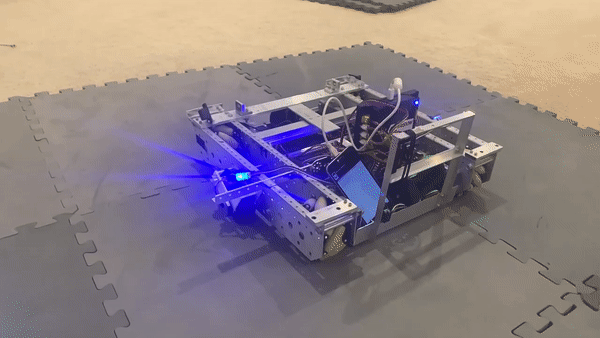

# PIDControllers Test

<p style = "font-weight : 300; font-size : 24px;">
In this page, we will test to check that three PID Controllers are tuned properly.
</p>

---


<figure align="center">
    
    <figcaption class="mt-2 text-sm text-center text-gray-600" style = "padding-top : 10px;">An example of testing the turnController</figcaption>
</figure>

---

# OpMode

First, we need to set up an OpMode to test the different movements. We will run this OpMode three different times; each run will test a different controller. For example, the first run will test the `turnController` , the second run will test the `driveController` , and the third run will test the `strafeController`.

---

#### Variables

- `mecanumDriveTrain` : Instance of our MecanumDriveTrain class.

Since the `turnController` , `driveController` , and `strafeController` are instantiated in the `MecanumDriveTrain` class, we don't need to make any other `PIDController` instances in this OpMode.

---

#### Init

In the init method, we will initialize the mecanumDriveTrain by passing in the hardwareMap and telemetry. 
The MecanumDriveTrain constructor will also reset all the encoders on the dead wheels.

```java
    @Override
    public void init(){
        mecanumDriveTrain = new MecanumDriveTrain(hardwareMap , telemetry);
    }   

```

---

#### Loop 

In the loop method, we will run the different test cases.
We will use the `tuner()` method to check each of the individual PIDControllers:

- For the `turnController`, we will input a `targetX` of 0 , `targetY` of 0 , and `targetHeading` of 90. A properly tuned turnController should turn the robot counter-clockwise 90 degrees in a smooth and accurate manner (low error).
- For the `driveController`, we will input a `targetX` of 0 , `targetY` of 20 , and `targetHeading` of 0. A properly tuned driveController should move the robot forward 20 inches in a smooth and accurate manner (low error).
- For the `strafeController`, we will input a `targetX` of 20 , `targetY` of 0 , and `targetHeading` of 0. A properly tuned strafeController should strafe the robot to the right 20 inches in a smooth and accurate manner (low error).

```java
    @Override
    public void loop(){
        // Tests the turn controller
        mecanumDriveTrain.tuner(0 , 0 , 90 , 0.75);
        
        // Tests the drive controller
        // mecanumDriveTrain.tuner(0 , 20 , 0 , 0.75);
        
        // Tests the strafe controller
        // mecanumDriveTrain.tuner(20 , 0 , 0 , 0.75);
        
    }   

```

We will also output the Robot's `x position` , `y position` , and `heading` to measure the amount of error between our target position and current positon.

---

# Final OpMode

```java
@TeleOp
public class PIDTester extends OpMode{
    MecanumDriveTrain mecanumDriveTrain;

    @Override
    public void init(){
        mecanumDriveTrain = new MecanumDriveTrain(hardwareMap , telemetry);
    }

    @Override
    public void loop(){
        // Tests the turn controller
        mecanumDriveTrain.tuner(0 , 0 , 90 , 0.75);
        
        telemetry.addData("X position : " , mecanumDriveTrain.odometry.getX());
        telemetry.addData("Y position : " , mecanumDriveTrain.odometry.getY());
        telemetry.addData("Heading : " , mecanumDriveTrain.odometry.getHeading());
        telemetry.update();

        // Tests the drive controller
        // mecanumDriveTrain.tuner(0 , 20 , 0 , 0.75);

        // Tests the strafe controller
        // mecanumDriveTrain.tuner(20 , 0 , 0 , 0.75);

    }

}   
```

---

# Test

>> [!TIP] The testing process for each of the PID controllers is the same , so the following can be used for all three. The only thing to change for each test case are the target positions for X , Y , and Heading.

1. We will now begin the testing process. Start by clearing a wide area of space for the robot to mvoe in.
2. Initialize the `PIDTester` OpMode and ensure that no errors are thrown.
3. Run the OpMode

