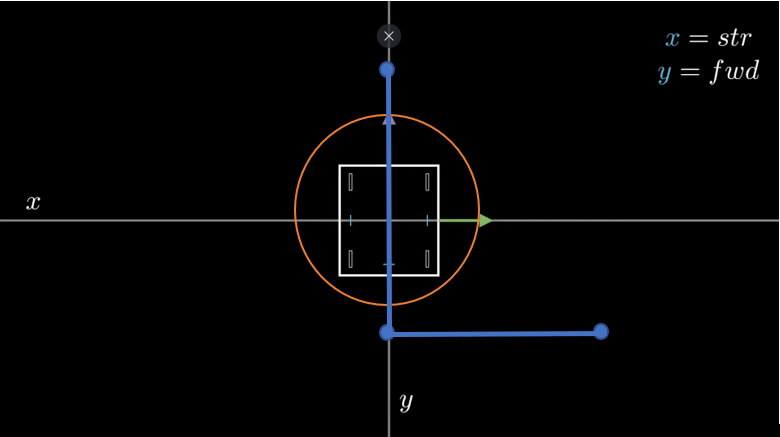
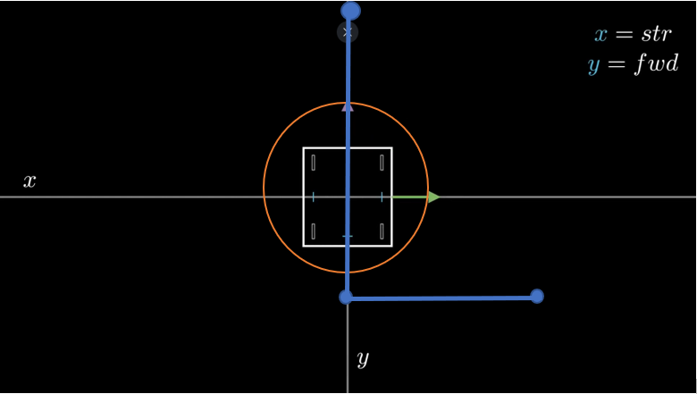
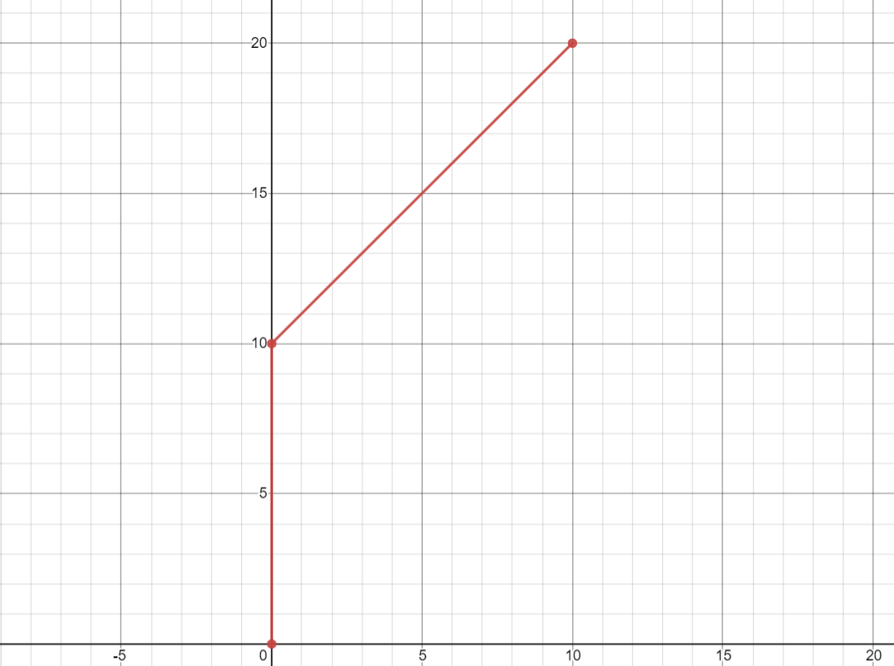
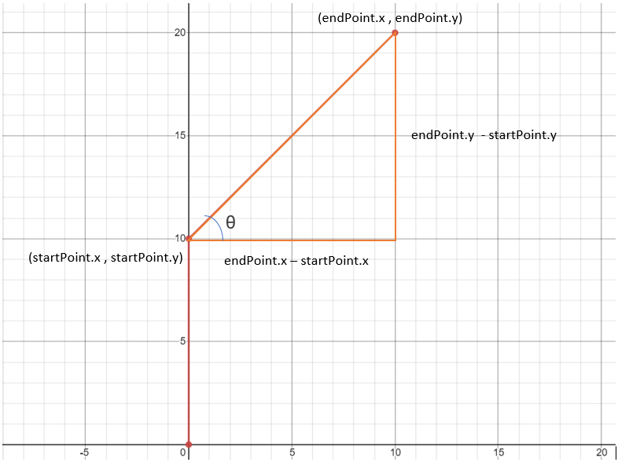
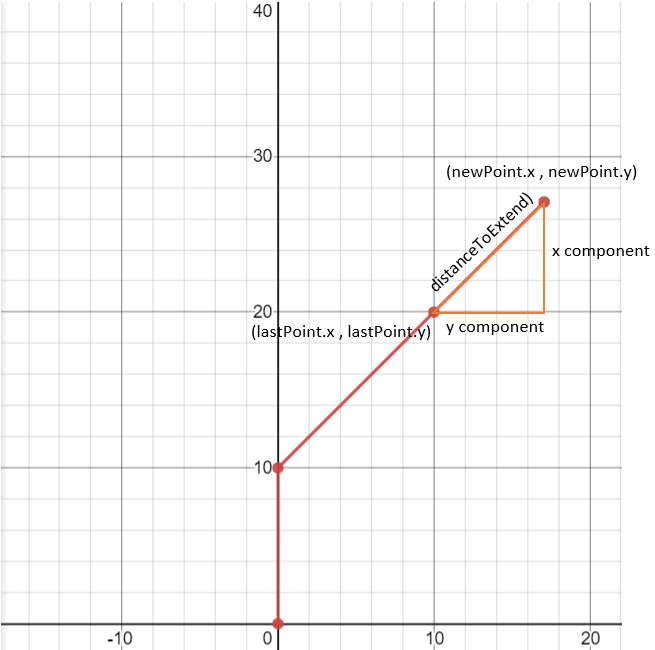

# Heading Point

<p style = "font-weight : 300; font-size : 24px;">
This page will go over the code implementation of the extendPath() method.
</p>

---

## Why a separate lookahead point for heading?

To understand why we need a seperate lookahead point for heading, let's take a robot that is nearing the end of the path as an example.

<figure align="center">
    
    <figcaption class="mt-2 text-sm text-center text-gray-600">A robot nearing the end of a path.</figcaption>
</figure>

By the logic of our getLookaheadPoint() method, the lookahead would be set to the last point of the path. But, a problem occurs; if the robot moves towards the target point and overshoots a bit, the entire robot would turn around to correct the overshoot instead of just moving a bit backwards. This is because , when the robot overshoots the target point by even a little, the target point would be behind the robot causing it to think it has to turn around.

The solution for this would be having a different path is an extended version of the path in which we would intersect and get the heading point, so if we overshoot, the heading point is still in front of the robot and the field centric method would just move the robot backwards to fix the overshoot.

<figure align="center">
    
    <figcaption class="mt-2 text-sm text-center text-gray-600">The original path extended.</figcaption>
</figure>


## Solution

The solution to this problem would be having two different lookahead points in our algorithm instead of just one:
- Target lookahead : The lookahead point to move towards
- Heading lookahead : The heading point to face towards


# Code Implementation

The code implementation for this would be a method that extends the path a certain distance that we can we use to intersect the robot with to find the heading lookahead

To understand the math behind path extension, let's take a path that we want to extend by 10 inches for example:

---

<figure align="center">
    
    <figcaption class="mt-2 text-sm text-center text-gray-600">An example of a path.</figcaption>
</figure>

---

1. Get the angle of the last segment of the path.

---

<figure align="center">
    
    <figcaption class="mt-2 text-sm text-center text-gray-600">The x and y components of the last segment of the path</figcaption>
</figure>

---

The angle, denoted by theta, can be found by arc tangent (endPoint.y - startPoint.x , endPoint.x - startPoint.x).

In this example the equation would be theta = arctan(20 - 10 , 10 - 0) which is equal to `0.78539816 radians` or `45 degrees`.

2. Find the x and y components of the distance we want to extend the path by:

- x component : Math.cos(lastSegmentAngle) * distance
- y component : Math.sin(lastSegmentAngle) * distance

3. Add these components to the last point of the path

---

<figure align="center">
    
</figure>

---

The x and y of the extended point can be found by (lastPointOfSegment.x + xComponent , lastPointOfSegment.y + yComponent).

4. Set the x and y of the last point equal to the extended point and return the path


```java 
    public static ArrayList<Point> extendedPath(ArrayList<Point> path , double distance){
        ArrayList<Point> copyPath = new ArrayList<>(path);
        
        Point endPoint = copyPath.get(copyPath.size() - 1);
        Point startPoint = copyPath.get(copyPath.size() - 2);
        
        double lastSegmentAngle = Math.atan2(endPoint.y - startPoint.y , endPoint.x - startPoint.x);
        
        double x_component = Math.cos(lastSegmentAngle) * distance;
        double y_component = Math.sin(lastSegmentAngle) * distance;
        
        endPoint.setPoint(new Point(endPoint.x + x_component , endPoint.y + y_component));
        return copyPath;
    }

```

---

<p style = "font-weight : 300; font-size : 24px;">
We now have a method that can return a new extended path that we can use for heading point.
</p>
