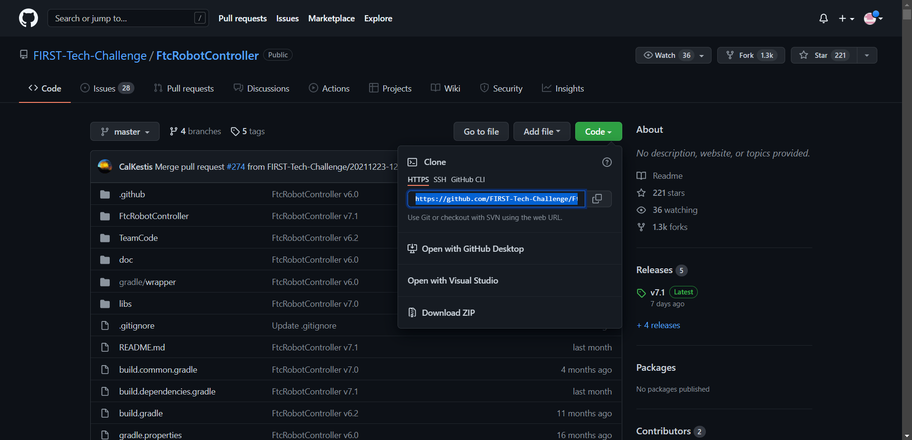
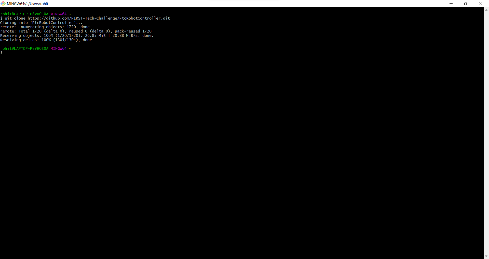
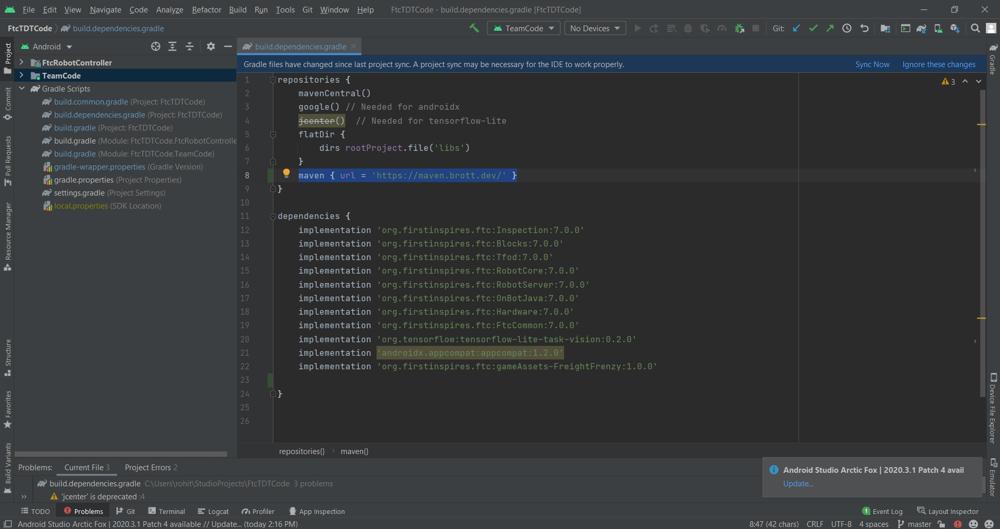
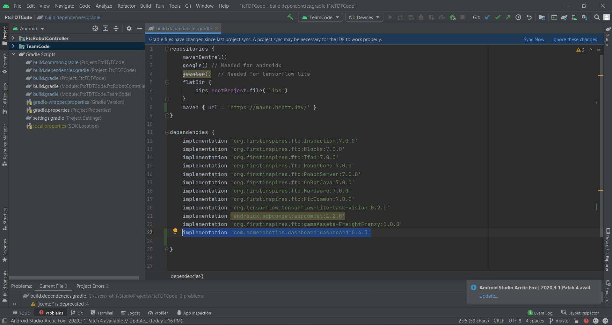

# Library Installations

> [!WARNING]
> This page assumes that you are familiar with GitHub and Cloning a repository

> [!TIP]
> If you need to refresh your understanding of how to Git Clone and change gradle settings, you can find thorough explanations on youtube and other websites.

## FTC SDK

The FTC SDK contains code that we can use to build an Android app to control a FTC competition bot. To use this SDK, we will clone it onto the local computer.

### Installation process

---

1. Navigate to the [FTC SDK Github repository.](https://github.com/FIRST-Tech-Challenge/FtcRobotController)
2. Under the code button, you should see a url in the format : `https://github.com/FIRST-Tech-Challenge/FtcRobotController.git`

<figure align="center">
    
</figure>

3. Copy this link and open up `Git Bash`
4. Navigate to the directly you want to clone the repository to by using `cd`
5. Type the command `git clone` and paste the url from `step 2`.\

<figure align="center">
    
</figure>

6. Open the directory on `Android Studio` and allow the gradle to sync.
7. You have successfully cloned the `FTC SDK`.

## FTCDashboard

The FTCDashboard is a web app created by `acmerobotics` and we will mainly be using it for tuning PID Controllers. It is a web dashboard made for FTC with features such as Live telemtry graphing and display, real time configuration variable tuning while opmodes are running as well as the ability to initialize and run OpModes directly from the dashboard website.
All of these features will make PID Tuning infinitely more convenient and accurate.

### Installation process

---

1. Start by opening the `build.dependencies.gradle` file from your project directory.
2. In the `repositories` section , add `maven { url = 'https://maven.brott.dev/' }`:
<figure align="center">
    
</figure>

3. Find the `dependencies` section, add `implementation 'com.acmerobotics.dashboard:dashboard:0.4.3'`:
<figure align="center">
    
</figure>

4. Perform a gradle sync
5. You have successfully installed the FTCDashboard

