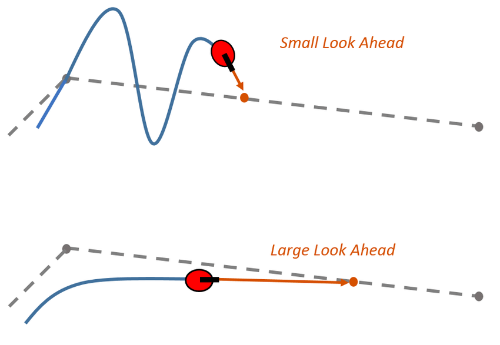

# Lookahead Point

---

> [!ATTENTION]
> This page is for both Tank and Mecanum Drivetrains.

<b>Lookahead point</b> is a point on the path that is a certain distance away, a constant called the lookahead distance , from the current position
on the robot. The lookahead point can also be referred to as the target position.

## Lookahead Distance

> [!TIP]
> The lookahead distance should be tuned as per your desire on how smooth or how sudden the turns should be. If you want a very curved path, then a larger lookahead is needed while precise , fast turns require a smaller one.

The lookahead distance is a constant that specifies how far the robot should "lookahead" from the current position. It is one of the main tuning property that can decide the difference between a smooth path or a oscillating path in which the robot constantly overshoots when turning.

---

<figure align="center">
    
    <figcaption class="mt-2 text-sm text-center text-gray-600">An visual of the results of different lookahead distances. The lookahead point in these images is the red circle that the arrow is pointing to</figcaption>
</figure>

---
