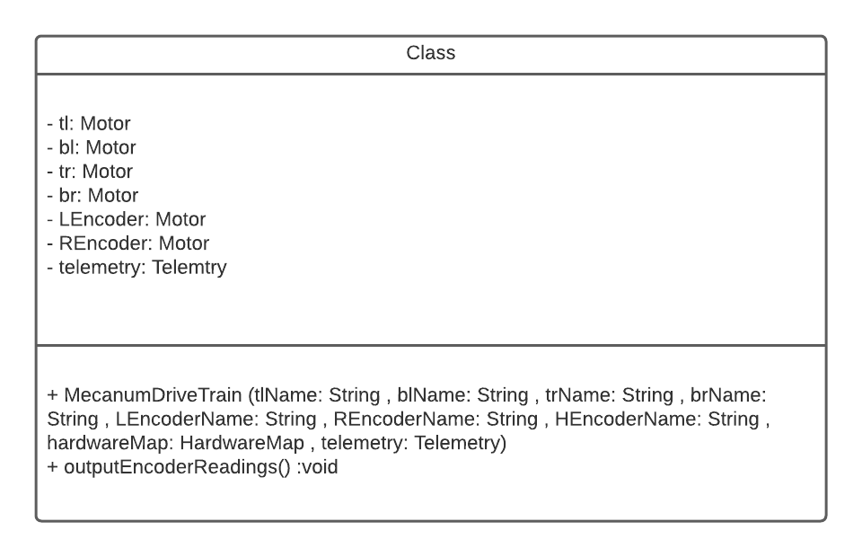

# Mecanum Drivetrain

<p style = "font-weight : 300; font-size : 24px;">
On this page we will set up the Mecanum Drivetrain class. This class will contain all the movement code for the robot as well as the drivetrain motors and odometry encoders.
For now , we will set up the constructor and debugging method that will return the encoder readings from the encoders. More methods and variable will be added as we progress through this documentation.
</p>

---

> [!ATTENTION]
> This page is only for Mecanum Drivetrains.

?>
Create the `MecanumDriveTrain.java` file under the `TeamCode` folder in your project directory.
> ```text
.
└── TeamCode
    ├── Motor.java
    ├── `MecanumDriveTrain.java`
> ```

---


<figure align="center">
    
    <figcaption class="mt-2 text-sm text-center text-gray-600" style = "padding-top : 10px;">MecanumDriveTrain class diagram</figcaption>
</figure>

---


## Global Variables
These variable can be named as per your preference
- `tl` : Top Left motor variable
- `bl` : Bottom Left motor variable
- `tr` : Top Right motor variable
- `br` : Bottom Right motor variable
- `LEncoder` : Left Parallel Encoder motor variable
- `REncoder` : Right Parallel Encoder motor variable
- `HEncoder` : Horizontal Encoder motor variable
- `telemetry` : Telemetry instance used for debugging

```java 
    //Declare the variables for the mecanum drive train class 
    /* Although the encoders aren't DcMotors, they can be initialized as one 
    since they are connected to the drive train motor encoder ports on the rev hub.
    For Example, if the Left Encoder is attached to the port associated with the tl
    Motor , then the hardware name for the Left Encoder and the tl Motor would be the same
    */
    
    
    private Motor tl;
    private Motor bl;
    private Motor tr;
    private Motor br;
    private Motor LEncoder;
    private Motor REncoder;
    private Motor HEncoder;
    private Telemetry telemetry;
```

## Constructor

In this constructor , all the drive train motors and odometry encoders will be initialized. Additionally, the
encoders will be reset and the zero power behavior is set.

```java 
    public MecanumDriveTrain(String tlName, String blName, String trName, String brName , String LEncoderName , String REncoderName , String HEncoderName , HardwareMap hardwareMap , Telemetry telemetry) {
        this.tl = new Motor(tlName , hardwareMap);
        this.bl = new Motor(blName ,  hardwareMap);
        this.tr = new Motor(trName , hardwareMap);
        this.br = new Motor(brName , hardwareMap);
        
        this.LEncoder = new Motor(LEncoderName , hardwareMap);
        this.REncoder = new Motor(REncoderName , hardwareMap);
        this.HEncoder = new Motor(HEncoderName , hardwareMap);
        
        // You can call the methods to set the motor modes
        this.LEncoder.reset();
        this.REncoder.reset();
        this.HEncoder.reset();
        
        // This part is depends on your preference for zero power behavior. For the implementation on my robot, I will set it to break mode.
        this.tl.setBreakMode();
        this.bl.setBreakMode();
        this.tr.setBreakMode();
        this.br.setBreakMode();
        
        this.telemetry = telemetry;
    }
```

## Encoder Reading Test Method

This method will be called in an OpMode loop and we manuever the robot forward and sideways. By observing the telemtry output, we can figure out which encoders need to be reversed.

```java 
   public void outputEncoderReadings(){
        telemetry.addData("Left Encoder Position Inches : " , LEncoder.getCurrPosInches());
        telemetry.addData("Right Encoder Position Inches : " , REncoder.getCurrPosInches());
        telemetry.addData("Horizontal Encoder Position Inches : " , HEncoder.getCurrPosInches());
        telemetry.update();
   }
```

---

<p style = "font-weight : 300; font-size : 24px;">
For now, the mecanum drive train class is very simple. The class in its current state will allow us to run the robot and decide which encoders to reverse.
</p>

