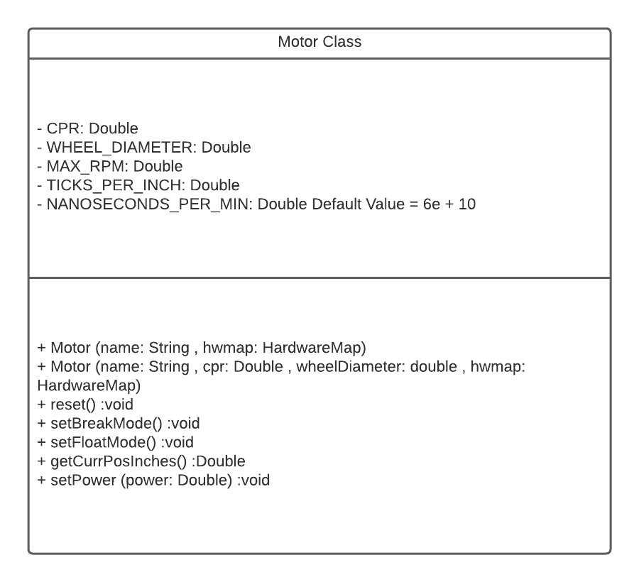

# Motor Class

> [!ATTENTION]
> This page is for both Tank and Mecanum Drivetrains.

<p style = "font-weight : 300; font-size : 24px;">
We will set up the motor class. The motor class will consist of constructors and functions necessary for getting data from the encoders and setting powers.
</p>

---

?>
Create the `Motor.java` file under the `TeamCode` folder in your project directory.
> ```text
.
└── TeamCode
    └── `Motor.java`
> ```

---

<figure align="center">
    
    <figcaption class="mt-2 text-sm text-center text-gray-600" style = "padding-top : 10px;">Motor class diagram</figcaption>
</figure>


---

## Constants
- `CPR` : Counts per revolution of the encoder
- `WHEEL_DIAMETER` : Diameter of the respective wheel attached to the motors and DeadWheel Encoders in inches
- `MAX_RPM` : The maximum revolutions per minute of the encoder
- `NANOSECONDS_PER_MIN` : The number of nanoseconds in a minute
- `TICKS_PER_INCH` : Stores the calculated ticks per inch traveled for the encoder

```java 
    //Declare all the constants in the Motor class
    private double CPR;
    private double WHEEL_DIAMETER;
    private double MAX_RPM;
    private double TICKS_PER_INCH;
    private double NANOSECONDS_PER_MIN = 6e+10;
```

## Constructor
There will be two constructors in this class:
- One used for initializing the drive train motors
- One used for initializing the dead wheel encoders

```java 
    /* Constructor for drive train motors
       Parameter name : Pass in name of the motor on the RC phone config
       Parameter hwmap : Pass in the hardwareMap from OpMode to initialize the motor */
    
    public Motor(String name , HardwareMap hwmap){
        motor = hwmap.dcMotor.get(name);
    }
    
    /* Constructor for dead wheel encoders
       Parameter name : Name of the motor connected to the respective encoder port
       Parameter cpr : Encoder ticks per one revolution
       Parameter wheelDiameter : Diameter of the dead wheel 
       Parameter hwmap : Pass in the hardwareMap from OpMode to initialize the motor */
    
    public Motor(String name , double cpr , double wheelDiameter , HardwareMap hwmap){
        motor = hwmap.dcMotor.get(name);
        this.cpr = cpr;
        this.wheelDiameter = wheelDiameter;
        this.TICKS_PER_INCH = cpr / (wheelDiameter * Math.PI);
    }    
    
```

## Resetting the motor

This method is very important as the Dead Wheel and Drive Train encoders as the encoder readings need to reset back to 0.0 during initialization. This prevents any problems that may occur with the motor beginning the OpMode with a reading from a previous run which can mess up position calculations.

```java 
    public void reset(){
        motor.setMode(DcMotor.RunMode.STOP_AND_RESET_ENCODER);
        motor.setMode(DcMotor.RunMode.RUN_WITHOUT_ENCODER);
    }
```

## Setting Zero Power Behaviors

The following methods are used to set the different Zero Power Behaviors:
- Break Mode : The robot stops instantly when the power is set to zero
- Float Mode : The robot moves a bit when the power is set to zero

The optimal option is to set the Zero Power Behavior to Break Mode to increase the path following accuracy. When the robot reaches the end of the path and the power is set to zero, the robot would instantly stop close to the target instead of drifting a bit.

```java 
    public void setBreakMode(){
        motor.setZeroPowerBehavior(DcMotor.ZeroPowerBehavior.BRAKE);
    }

    public void setFloatMode(){
        motor.setZeroPowerBehavior(DcMotor.ZeroPowerBehavior.FLOAT);
    }
```

## Current position of encoder in inches

The position of the encoder ticks can be converted into inches using the equation: Current Position Inches = Current Position in ticks / # of ticks per inch
```java 
     public double getCurrPosInches(){
        return motor.getCurrentPosition() / TICKS_PER_INCH;
    }
```

## Setting power

```java 
    public void setPower(double power){
        motor.setPower(power);
    }
```

---
