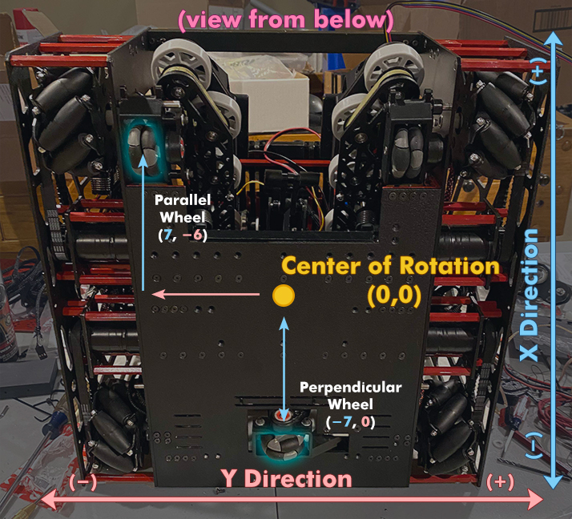

# Odometry

---

> - [Dead Wheels](https://rohitdasari0424.github.io/dead-wheel.html)
> - [Odometry Implementation](https://rohitdasari0424.github.io/#/odometry-overview)

---

> [!ATTENTION]
> This page is for both Tank and Mecanum Drivetrains.

>> [!ATTENTION]
> There are two configurations for odometry: two-wheel odometry and three-wheel odometry. We will only focus on the implementation of three-wheel odometry on this site as it is more accurate and precise.

---

<b>Odometry</b> is the use of sensor data to calculate the robot's location on the field (x , y). Rapid , accurate readings and processing of the data is required for Odometry to be powerful. However, as powerful as odometry can be, it can be just as terrible if you don't account for confounding factors such as slippage and uneven terrains.
Using the left , right , and horizontal encoder ticks from the Dead Wheels, odometry uses trig functions to integrate the change in position and heading over time. It plays an essential role in path following as knowing the exact location of the robot ( x , y , and heading ) is a must for accurate and precise movements.

<b>Odometry</b> has two tunable values :
- `Track Width`
- `Aux Width`

---

## Track Width
> [!TIP]
> For track width to work properly, the two vertical encoders need to be placed parallel to each other a good distance away from each other (8+ inches).

>[Track Width Tuning](https://rohitdasari0424.github.io/#/trackwidth-tuner)

Track Width is the distance between the two parallel Dead Wheels which is essential for calculating the heading of a robot.

## Aux Width
> [!TIP]
> It is preferred that the horizontal encoder is placed exactly in the middle of rotation which essentially makes AUX width 0.

>[Aux Width Tuning](https://rohitdasari0424.github.io/#/aux-width-tuning)

Aux Width is the distance between the horizontal encoder and the robot's center of rotation.

---

<figure align="center">
    
    <figcaption class="mt-2 text-sm text-center text-gray-600" style = "padding-top : 10px;">An example of odometry set up with three dead wheels ( Two parallel and one horizontal). In this example, the Track Width would be (2.0 * 7.0), 14 and the Aux Width would be 7.0</figcaption>
</figure>

---

