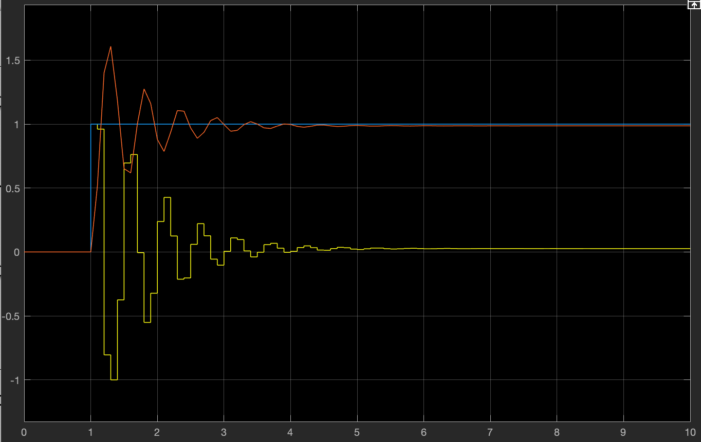

# P-Value of the PID Controller

<p style = "font-weight : 300; font-size : 24px;">
This page will go over the code implementation of the P-Term of the PID Controller.
</p>

---

## What is the Proportional Term?

The <b>P-Value</b> is arguably the most important part of the PID Controller as it brings the system closest to the target. However, it is usually not great to use P alone, as when something gets close to it's desired position, the error is small. This means that you also get a small P value which doesn't always get you exactly to your desired target position.
Aditionally, a P Controller alone can result in steady state error and oscillations.

For this reason, the PID Controller is used such that the P-Value does most of the heavy lifting ( gets the system closest to the target position ) while the I-Value works to give the system a final push to get to the target position and the D-Value works to reduce the oscillations that may occur.

The <b>P-Value</b> is directly proportional to the error of the system, as error decreases so does the P-Value and as the error increases, the P-Value increases.

> [!ATTENTION]
> While D & I term may be optional to use, the P term is absolutely necessary for a PID controller

---

## Tunable Constant

The tunable constant for the P-Value is the `KP` constant. This constant is multiplied by the error of the system (difference between target and current position) thus the name "proportional".
Having an absurdly high KP value could cause <b>overshoot</b> while having one that is too low could cause <b>undershoot</b>. 

---

## What is overshooting and undershooting?

`Overshooting` occurs when the PID Controller can not slow down fast enough, causing the system
to move past the target position, before moving backwards and correcting the overshoot. This could be detrimental to hardware such as linear slides or drive train motors. It is a direct result
of `KP` being too <b>high</b> and can be resolved by <b>decreasing</b> it.

`Underhooting` occurs when the PID Controller does not output enough power to bring the system close the target position. It is a direct result of `KP` being too <b>low</b> and can be
resolved by <b>increasing</b> it.

---

## How does the KP Constant work?

To fully understand the KP constant , take a robot that is facing 0 degrees with a 45 degrees target position as an example:
- `Current position` : The current position in this example would be 0 degrees
- `Target position` : The target position in this example would be 45 degrees
- `error` : The error in this example would be Target position - Current position which is 45 degrees
- `KP` : Let's use a kp of 0.02

For example purposes, let's assume that we are only using a `P controller` (PID Controller without the use of I and D).
The power output of the controller when the robot is 45 degrees away from the target would be `KP * error` which is `(45 - 0) * 0.02` which would be <b>0.9</b>.
When the PID loop is run again, say the robot heading is now 8 degrees. Now the power output would be `(45 - 8) * 0.02` which would be <b>0.64</b>.

As the loop repeatedly runs and the robot gets closer and closer to the target, the P-Value will continuously decrease. With a KP value that is too low, the robot may <b>undershoot</b> (38 degrees instead of 45) while a KP value that is too high will cause the robot to <b>overshoot</b> (50 degrees instead of 45).
For this reason, it is important to tune the KP value very well such that the robot doesn't overshoot or undershoot too much.

---

## Why do we need the I and D values?

Although the P-Value can get the error of the system pretty close to 0, a well-tuned P Controller can still have steady-state error and oscillations. For this reason,
the I-Value and D-Values need to be utilized to reduce them to increase the accuracy and smoothness of the system.

---

>> [!INFO]
>>- The red line represents the response of the system over time (i.e. encoder position , robot heading).
>>- The blue line represents the target position (i.e. target encoder position , target heading).

<figure align="center">
    
    <figcaption class="mt-2 text-sm text-center text-gray-600" style = "padding-top : 10px;">System response with a well tuned KP Value.</figcaption>
</figure>

---

The `steady state error` in this system is seen by the distance between the red line and the blue line where <b>x >= 5</b> after setting near the target position.

The `oscillations` in this system can be seen by the red line (response of the system) overshooting and 
undershooting the blue line (target position) where <b>x is between 1.2 and 3</b>.

---

## Code Implementation

The following code shows the implementation of the P-Value of the PID Controller. Put this in the beginning of the getOutput() method.

```java 
    // Set the global error variable equal to the target position - current position 
    // For example, if you are facing forward and want to turn to 45 degrees, the error would be 45 (target heading) - 0 (current robot heading)
    this.error = targetPos - currPos;
    this.previousError = error; // Store the current error so we can use it during the next loop run
    double P = KP * error; // Proportional term : KP constant * the error of the system
```

[//]: # ()
[//]: # (<!-- tabs:start -->)

[//]: # ()
[//]: # (#### **getOutput&#40;double currPos, double targetPos&#41;**)

[//]: # (```java )

[//]: # (    // Set the global error variable equal to the target position - current position )

[//]: # (    // For example, if you are facing forward and want to turn to 45 degrees, the error would be 45 &#40;target heading&#41; - 0 &#40;current robot heading&#41;)

[//]: # (    this.error = targetPos - currPos;)

[//]: # (    this.previousError = error; // Store the current error so we can use it during the next loop run)

[//]: # (    double P = KP * error; // Proportional term : KP constant * the error of the system)

[//]: # (```)

[//]: # ()
[//]: # (#### **getOutput&#40;double error&#41;**)

[//]: # (```java )

[//]: # (    // We already know the error of the system since we passed it in as an argument)

[//]: # (    )
[//]: # (    this.previousError = error; // Store the current error so we can use it during the next loop run)

[//]: # (    double P = KP * error; // Proportional term : KP constant * the error of the system)

[//]: # (```)

[//]: # ()
[//]: # (<!-- tabs:end -->)

<p style = "font-weight : 300; font-size : 24px;">
This is what the getOutput() method should look like thus far:
</p>

```java 
    public double getOutput(double currPos , double targetPos){
        this.error = targetPos - currPos;
        this.previousError = error;
        double P = KP * error; // Proportional term : KP constant * the error of the system
    }
```

[//]: # ()
[//]: # (<!-- tabs:start -->)

[//]: # ()
[//]: # (#### **getOutput&#40;double currPos, double targetPos&#41;**)

[//]: # (```java )

[//]: # (    public double getOutput&#40;double currPos , double targetPos&#41;{)

[//]: # (        this.error = targetPos - currPos;)

[//]: # (        this.previousError = error;)

[//]: # (        double P = KP * error; // Proportional term : KP constant * the error of the system)

[//]: # (    })

[//]: # (```)

[//]: # ()
[//]: # (#### **getOutput&#40;double error&#41;**)

[//]: # (```java )

[//]: # (    public double getOutput&#40;double error&#41;{)

[//]: # (        this.previousError = error;)

[//]: # (        double P = KP * error; // Proportional term : KP constant * the error of the system)

[//]: # (    })

[//]: # (```)

[//]: # ()
[//]: # (<!-- tabs:end -->)
