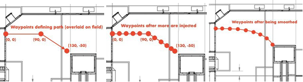

# Path Generation

---

> [!ATTENTION]
> This page is for both Tank and Mecanum Drivetrains.

<b>Path Generation</b> will be used to do two things:
- Inject the path with more points
- Smooth the path

---
## Injecting the path

Injecting the path is an important part of getting a smooth path. The injecting algorithm calculates how many evenly spaced points would fit in each line segment of the path and then injects them. The end result would be a new path with the exact same shape , but more points along its individual line segments

## Smoothing the path

Smoothing the path takes a
2D array of XY coordinates and returns a smoother version of the coordinates. It works best when the inputted path consists of many points.

---

<figure align="center">
    
    <figcaption class="mt-2 text-sm text-center text-gray-600">Visual explanation of injecting the path and smoothing it</figcaption>
</figure>

The main goal of the path generation is to make the path more smooth which in turn will make the robot movement smoother and accurate.

---
