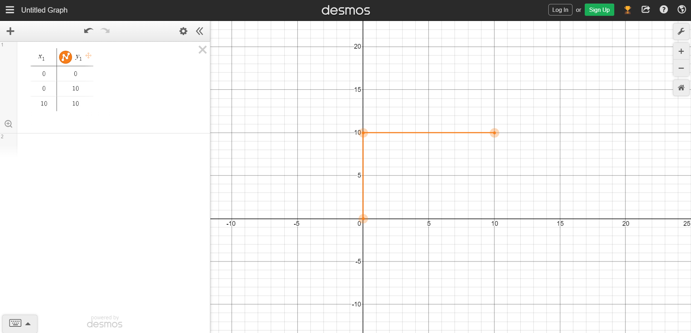

# Path


---

A <b>Path</b> is a set of points consisting of x and y coordinates. The robot would then follow this path and knows it has finished it once it reaches the final point in the path.

> [!ATTENTION]
> This page is for both Tank and Mecanum Drivetrains.

---

```java 
    // Initializing the path array list
    ArrayList<Point> path = new ArrayList<>();
    
    // Add Points to the path
    path.add(new Point(0 , 0)); // X coordinate : 0 , Y coordinate : 0
    path.add(new Point(0 , 10)); // X coordinate : 0 , Y coordinate : 10
    path.add(new Point(10 , 10)); // X coordinate : 10 , Y coordinate : 10
```

---

---

<figure align="center">
    
    <figcaption class="mt-2 text-sm text-center text-gray-600" style = "padding-top : 10px;">Visual representation of the path created.</figcaption>
</figure>

---

