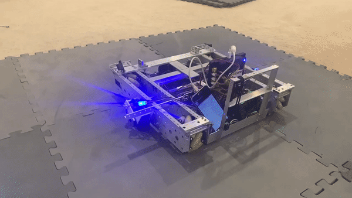

# PID

> [!ATTENTION]
> This page is for both Tank and Mecanum Drivetrains.

> [!TIP]
> For PID Controllers to work properly, they need to be tuned very well. It is necessary to re-tune the PID Controllers whenever a heavy mecahnical change is made to the robot. With that in mind, it is optimal to tune PID Controllers only when you are sure there won't be any other significant mechanical changes on the robot.
We will go over how to tune a PID controller later on in the documentation.

---

<b>PID</b> is used to bring something from one state to another in an accurate and smooth fashion. In the case of motors, this could be driving to a certain distance while slowing down on the way or ramping up a flywheel to a certain speed and allowing it to maintain the speed regardless of anything that may slow it down.
It is a function of the error in a system. Error being the difference between where you want to be and where you are. This could be the difference between the current position of a motor, and it's desired position or if you had a flywheel, this could be desired rpm and current rpm. If you imagine PID as an equation, your x (input) would be error and your y (output) would be motor power.
PID is widely used for autonomous movements and automation in tele-op. Compared to inaccurate methods of movements such as time-based which could produce vastly different results each run since they don't account for confounding factors such as the terrain, battery voltage, etc. , a properly tuned PID Controller can consistently bring a robot from one state to another in an accurate manner.

---

<figure align="center">
    
    <figcaption class="mt-2 text-sm text-center text-gray-600" style = "padding-top : 10px;">An example of a robot using PID to turn 90 degrees clockwise</figcaption>
</figure>

---
