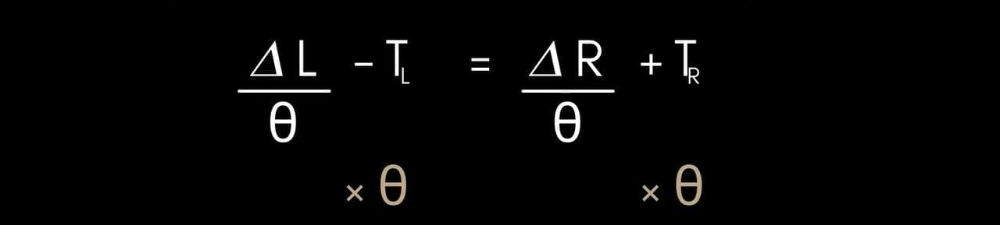

# Update Tracker

<p style = "font-weight : 300; font-size : 24px;">
This page will go over the code implementation and explanation of the updateTracker() method in odometry.
</p>


---

The code implementation of the updateTracker() method uses the current position the left , right , and horizontal encoders and the previous values of these positions to calculate the change in position since the last loop which is integrated to the x , y , and heading values.


## Storing the current positions of the encoders

---

We will start the implementation of the updateTracker() method by storing the current position of the encoders

```java 
double leftPosition = LEncoder.getCurrPosInches();
double rightPosition = REncoder.getCurrPosInches();
double horizontalPosition = HEncoder.getCurrPosInches();
``` 

## Calculating the change in position

---

The next step is calculating the change in position for each encoder. The expression for this would be currentPosition - previousPosition.

```java 
double deltaLeft = leftPosition - prevLeftE;
this.prevLeftE = leftPosition; // Stores the current leftPosition to be used during the next update
double deltaRight = rightPosition - prevRightE;
this.prevRightE = rightPosition; // Stores the current rightPosition to be used during the next update
double deltaHorizontal = horizontalPosition - prevHorizontalE;
this.prevHorizontalE = horizontalPosition; // Stores the current horizontalPosition to be used during the next update
``` 

## Calculating the deltaHeading

---

In this section, we will thoroughly explain the math and provide visuals to understand the calculation for deltaHeading, the change in angle since the last update.
To fully understand the math behind calculating deltaHeading, let's take a robot that has moved forward while turning an angle of 15 degrees as an example :

> Here are some math principles you should know:
> - <b>`Arc length` = radius * arcAngle</b>
> - <b>`Concentric arcs`: Arcs that share the same circle center with a different radius. They have the same `arc angle`</b>

<figure align="center">
    
    <figcaption class="mt-2 text-sm text-center text-gray-600">A robot that has moved forward while turning 15 degrees clock wise. Notice that the left and right arcs created by the right and left encoders respectively are concentric arcs.</figcaption>
</figure>

---


#### Calculating arc lengths

?><b> First we need to get the length of the left and right arcs. This could be calculated by currentPosition - previousPosition of the left and right encoders respectively.</b>

In the case of this example, the left arc is equal to 17.606 inches and the right arc is equal to 13.81 inches.

---

#### Calculating left and right arc radius

Constants :
- `tl` : Distance from left arc to the center arc
- `tr` : Distance from right arc to the center arc

The radius of the left arc can be calculated by the R (radius of the center arc) + tl.
The radius of the right arc can be calculated by the R (radius of the center arc) - tr.

---

In the case of this example , the radius of the left arc is <b>R + 7.25</b> inches while the right arc is <b>R - 7.25</b> inches.

---

#### Using the arc length formula to solve for arc angle

> Since we know the arc length and the radius of each circle created by the left and right arcs using known variables, we can use the :
>
><b>arc length</b> = radius * arcAngle
>
>equation to solve for the arcAngle which would be the deltaHeading:

Using this , we get two equations:
- <b>leftArcLength</b> = (R + tl) * arcAngle
- <b>rightArcLength</b> = (R - tr) * arcAngle

---

?> <b>Now we can isolate the R and set the equations equal to each other:</b>

- `arcAngle` will be represented by the theta sign
- `leftArcLength` will be represented by deltaLeft
- `rightArcLength` will be represented by deltaRight

<figure align="center">
    
    <figcaption class="mt-2 text-sm text-center text-gray-600">Divide both sides by arcAngle for both equations</figcaption>
</figure>

---

<figure align="center">
    
    <figcaption class="mt-2 text-sm text-center text-gray-600">Subtract tl from both sides in the deltaLeft equation and subtract tr from both sides in the deltaRight equation.</figcaption>
</figure>

---

<figure align="center">
    
    <figcaption class="mt-2 text-sm text-center text-gray-600">We have now isolated R</figcaption>
</figure>

---

?> <b>Now we can set the two equations to equal to each other and isolate the arcAngle:</b>

<figure align="center">
    
    <figcaption class="mt-2 text-sm text-center text-gray-600">Set the two equations equal to each other and multiply both sides by arcAngle</figcaption>
</figure>

---

<figure align="center">
    
    <figcaption class="mt-2 text-sm text-center text-gray-600">Get the terms with arcAngle on one side and the leftArcLength & rightArcLength on one side</figcaption>
</figure>

---

<figure align="center">
    
    <figcaption class="mt-2 text-sm text-center text-gray-600">Factor out the arcAngle</figcaption>
</figure>

---

<figure align="center">
    
    <figcaption class="mt-2 text-sm text-center text-gray-600">Isolate the arcAngle by dividing both sides by (tl + tr)</figcaption>
</figure>

---

>We have arrived at our final equation for deltaHeading : 
> - <b>arcAngle = (leftArcLength - rightArcLength) / (tr + tl)</b>
> where arcAngle is the deltaHeading (Change in angle since last update).

---

#### Code Implementation

In the code implementation:
- `leftArcLength` : deltaLeft
- `rightArcLength` : deltaRight
- `tl + tr` : trackWidth

Our final equation to implement deltaHeading in our code would be : (deltaLeft - deltaRight) / trackWidth

```java 
double deltaHeading = (deltaLeft - deltaRight) / trackWidth;
``` 

## Calculating Heading

---

The equation of total heading could be denoted as the integration of change in heading over time.

```java 
this.heading += deltaHeading;
``` 

## Calculating the horizontal offset

---

#### Why do we need the horizontal offset?

The horizontal encoder is supposed to measure the change in position of the encoder as it moves left and right in the x direction. However, when the horizontal encoder is not placed at the center of rotation, a problem occurs. While the robot turns, the horizontal encoder creates an arc and its position in inches changes even though the robot is not moving to the left or right. 

The solution to this problem is subtracting the length of the arc from deltaHorizontal:

[//]: # ()
[//]: # (<figure align="center">)

[//]: # (    )

[//]: # (    <figcaption class="mt-2 text-sm text-center text-gray-600">Visual of how the horizontal encoder creates an arc when turning if it is not placed at the exact center of rotation.</figcaption>)

[//]: # (</figure>)


<figure align="center">
    <video id="sampleMovie" src="Images/horizontal_offset.mov" height = "100%" width = "100%" style="border-radius: 1.5%" controls></video>
    <figcaption class="mt-2 text-sm text-center text-gray-600">The horizontal dead wheel creates an arc when robot turns in place.
</figcaption>
</figure>

---

#### Using the arc length formula to calculate the distance to offset

<b>Arc Length = radius * angleInRadians</b>:
- `radius` : The radius of the arc created is the `Aux Width`. This is because the center of the circle of the arc created by the horizontal encoder when turning is equal to the center of rotation of the robot. For this reason, the radius of the arc created by the rotation is equal to the distance between the horizontal dead wheel and the center of rotation.
- `angleInRadians` : The change in heading (deltaHeading).

Plugging in these value into the arc length equation gives us: <b> Arc Length = auxWidth * deltaHeading </b>

---

We can now calculate the horizontal offset:

```java 
double horizontalOffset = auxWidth * deltaHeading;
``` 

## Calculating relative x and y

The relative x and y are the changes in x and y positions with no regards to the angle. To understand this , let's take a robot facing -90 degrees for example:

If the robot were to move forward 10 inches, the relative x would be equal to 0 and the relative y would be equal to 10 even though the robot is moving on the x-axis since it is facing -90 degrees.
In other words, relative x and y are in relation to the robot, not the field.

Here is the code implementation for relative x and relative y :

- `relativeX` : The offset horizontal change
- `relativeY` : Average of the deltaLeft + deltaRight

```java 
double relativeX = horizontalChange - horizontalOffset;
double relativeY = (deltaLeft + deltaRight) / 2.0;
``` 


## Calculating global change in x and y position

In this section, we will implement the code that integrates and calculates the change in the global x and y position. Global meaning in relation the field , not the robot.

To understand the math behind the calculations , let's take a robot that has moved a certain x and y distance as an example:
- `xChange` : Represented by the delta x
- `yChange` : Represented by the delta y
- `relative Y` : Represented by dS

<figure align="center">
    
    <figcaption class="mt-2 text-sm text-center text-gray-600">A visual showing the delta x and delta y when the robot changes position while moving forward.</figcaption>
</figure>

The angle of the robot in this image is equal to the angle of the triangle denoted by theta.

Two equations can be used to figure out delta x and delta y:
- <b>Math.cos(theta) = deltaY / relative Y</b>
- <b>Math.sin(theta) = deltaX / relative Y</b>

Since we already know the values of theta and relative Y, the only unknown variables are deltaX and deltaY. So, using simple algebra we can isolate these two variables.
One thing to notice is that when the robot is moving forward at a 45-degree angle , for example, even though the y value is increasing, the x position is supposed to be decreasing since we are going further left. For this reason, we have to negate x change.
We end up with the equations :
- <b>deltaX = -Math.sin(theta) * relativeY</b>
- <b>deltaY = Math.cos(theta) * relativeY</b>

Ok, now we have the equations for change in global x and y positions... right? The answer is no. These two equations fail to compensate for a holonomic robot because since the robot can strafe, ∆x and ∆y can change even while the left and right wheels are not moving. In order to compensate for this, we can use the horizontal wheel. When the robot is strafing , the relativeX can be used:

<figure align="center">
    
    <figcaption class="mt-2 text-sm text-center text-gray-600">A visual showing the delta x and delta y when the robot changes position while strafing.</figcaption>
</figure>

Two equations can be used to figure out delta x and delta y:
- <b>Math.cos(theta) = deltaX / relativeX</b>
- <b>Math.sin(theta) = deltaY / relativeX</b>

Since we already know the values of theta and relative X, the only unknown variables are deltaX and deltaY. So, using simple algebra we can isolate these two variables.
We end up with the equations :
- <b>deltaX = Math.cos(heading) * relativeX</b>
- <b>deltaY = Math.sin(heading) * relativeX</b>

Since we have found two ways in which the global x and y positions can be changed, we can combine these equations to get two individual equations that calculate the total change in x and total change in y:
- <b>xChange = Math.cos(heading) * relativeX - Math.sin(heading) * relativeY</b>
- <b>yChange = Math.sin(heading) * relativeX + Math.sin(heading) * relativeY</b>

Now, we can implement this in code to integrate the change in x and y position over time. This will allow us to get the exact x and y position of the robot at any point of time.

```java 
this.x += Math.cos(heading) * relativeX - Math.sin(heading) * relativeY;
this.y += Math.cos(heading) * relativeX + Math.sin(heading) * relativeY;
```

---

<p style = "font-weight : 300; font-size : 24px;">
Here's what the updateTracker() method should look like this far:
</p>

```java 
    public void updateTracker(){
        double leftPosition = LEncoder.getCurrPosInches();
        double rightPosition = REncoder.getCurrPosInches();
        double horizontalPosition = HEncoder.getCurrPosInches();

        double deltaLeft = leftPosition - prevLeftE;
        this.prevLeftE = leftPosition; // Stores the current leftPosition to be used during the next update

        double deltaRight = rightPosition - prevRightE;
        this.prevRightE = rightPosition; // Stores the current rightPosition to be used during the next update
        
        double deltaHorizontal = horizontalPosition - prevHorizontalE;
        this.prevHorizontalE = horizontalPosition; // Stores the current horizontalPosition to be used during the next update

        double deltaHeading = (deltaLeft - deltaRight) / trackWidth;

        double horizontalOffset = auxWidth * deltaHeading;
        double relativeX = horizontalChange - horizontalOffset;
        double relativeY = (deltaLeft + deltaRight) / 2.0;
           
        this.heading += deltaHeading;
        this.x += Math.cos(heading) * relativeX - Math.sin(heading) * relativeY;
        this.y += Math.cos(heading) * relativeX + Math.sin(heading) * relativeY;
    }
``` 
